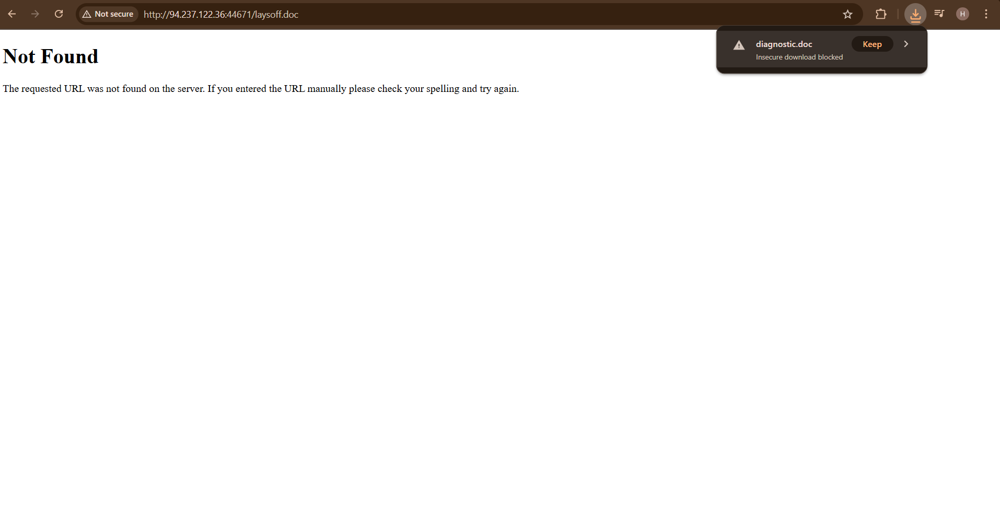
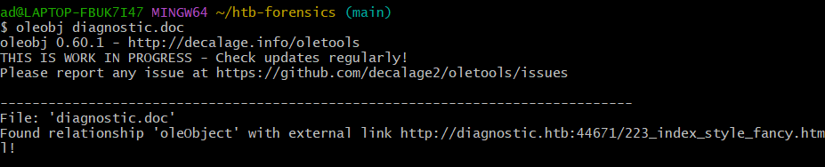
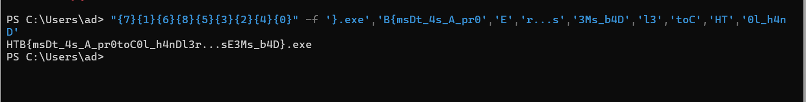

# DIAGNOSTIC - Hack The Box(Forensics)

**Độ khó:** Easy

---

##1. Giới thiệu challenge
- Nhiều email lừa đảo chứa liên kết đến diagnostic.htb/layoffs.doc
- DNS ngừng phân giải nhưng máy chủ vẫn lưu trữ tài liệu độc hại

##2. Mục tiêu
-Tìm flag trong tài liệu đó

##3. Phương pháp giải
Bước 1: Vào thử link web cho
 http://94.237.122.36:44671/laysoff.doc
- Sẽ tải về 1 file doc giống bên dưới ảnh:

Bước 2: Dùng oleid để phân tích file doc:
$ oleid diagnostic.doc
 - Tìm thấy 1 cái có Risk high sử dụng oleobj 
 - Dùng lệnh oloebj để vào được web html:
 $ oleobj diagnostic.doc

Bước 3: Truy cập vào web tìm được với url:
http://94.237.122.36:44671/223_index_style_fancy.html
Inspect trang html ta tìm được 1 đoạn mã màu cam 

- Dán đoạn mã đó vào https://www.base64decode.org/ encode ta được dòng sau:

- Có 1 đoạn file có vẻ như chứa flag:

Bước 4: Giải ra flag:
Copy đoạn đó vào PowerShell ta sẽ nhận được flag:
"{7}{1}{6}{8}{5}{3}{2}{4}{0}" -f '}.exe','B{msDt_4s_A_pr0','E','r...s','3Ms_b4D','l3','toC','HT','0l_h4nD'

 Flag tìm được là:
 HTB{msDt_4s_A_pr0toC0l_h4nDl3r...sE3Ms_b4D}
 - giải thành công:
 
 

---  
---
## 5. Kết luận bài học:
- Challenge giúp ta hiểu rõ cách tài liệu Office có thể bị lợi dụng để nhúng payload độc hại thông qua OLE object và URL bên ngoài. Việc sử dụng các công cụ như oleid, oleobj cho phép phát hiện nội dung ẩn trong file. 
- Đồng thời, bài học cũng cho thấy kẻ tấn công thường dùng Base64, PowerShell và kỹ thuật xáo trộn chuỗi để che giấu dữ liệu. Qua đó rèn luyện kỹ năng phân tích forensics và xử lý tài liệu độc hại thực tế.