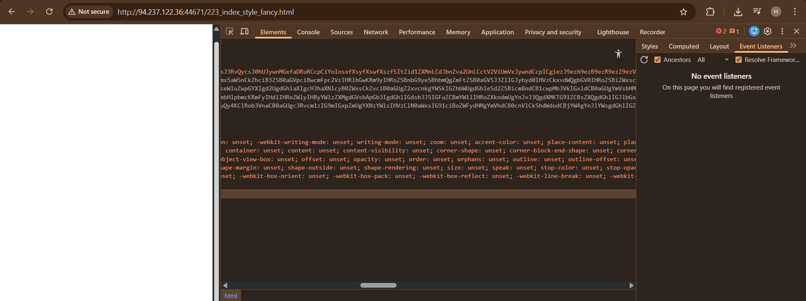
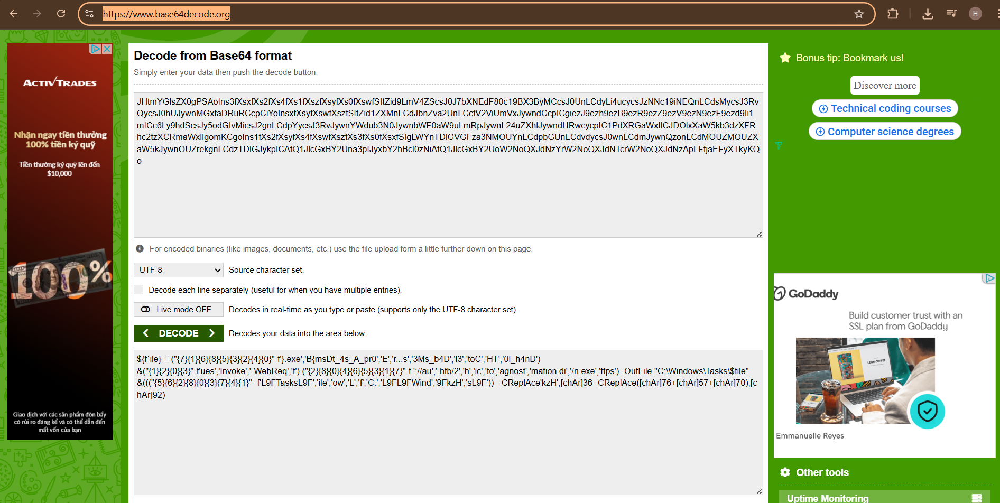

# DIAGNOSTIC – Hack The Box (Forensics)

**Độ khó:** Easy  
**Thể loại:** Forensics

---

## 1 Giới thiệu Challenge

- Nhiều email lừa đảo chứa liên kết tới `diagnostic.htb/layoffs.doc`
- DNS đã ngừng phân giải nhưng máy chủ vẫn lưu trữ tài liệu độc hại

---

## 2 Mục tiêu

- Tìm flag trong tài liệu Office độc hại

---

## 3 Phương pháp giải

### Bước 1: Tải file tài liệu

Truy cập trực tiếp vào địa chỉ IP của máy chủ:

```text
http://94.237.122.36:44671/layoffs.doc
```

- File `.doc` được tải về


---

### Bước 2: Phân tích file bằng oleid

Chạy công cụ oleid để kiểm tra file Office:

```bash
oleid diagnostic.doc
```

- Phát hiện OLE object với mức Risk: High
- Cho thấy tài liệu có thể chứa nội dung nhúng độc hại

Trích xuất nội dung nhúng bằng oleobj:

```bash
oleobj diagnostic.doc
```


---

### Bước 3: Phân tích file HTML

Truy cập vào file HTML được trích xuất:

```text
http://94.237.122.36:44671/223_index_style_fancy.html
```

- Inspect source HTML
- Phát hiện một đoạn mã Base64



Giải mã Base64 bằng công cụ online:

```text
https://www.base64decode.org/
```



- Dữ liệu thu được có dấu hiệu chứa flag

---

### Bước 4: Giải mã flag bằng PowerShell

Chạy đoạn PowerShell sau:

```powershell
"{7}{1}{6}{8}{5}{3}{2}{4}{0}" -f '}.exe','B{msDt_4s_A_pr0','E','r...s','3Ms_b4D','l3','toC','HT','0l_h4nD'
```

Kết quả:

```text
HTB{msDt_4s_A_pr0toC0l_h4nDl3r...sE3Ms_b4D}
```


---

## 4 Flag

```text
HTB{msDt_4s_A_pr0toC0l_h4nDl3r...sE3Ms_b4D}
```


---

## 5 Kết luận & Bài học rút ra

- Tài liệu Office có thể bị lợi dụng để nhúng payload độc hại thông qua OLE object và URL bên ngoài
- Công cụ oleid, oleobj giúp phát hiện và trích xuất nội dung ẩn hiệu quả
- Kẻ tấn công thường sử dụng Base64, PowerShell và kỹ thuật xáo trộn chuỗi
- Challenge giúp rèn luyện kỹ năng forensics và phân tích tài liệu độc hại thực tế
