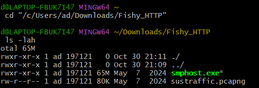
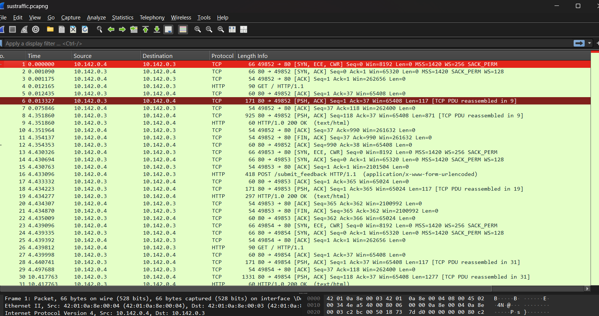
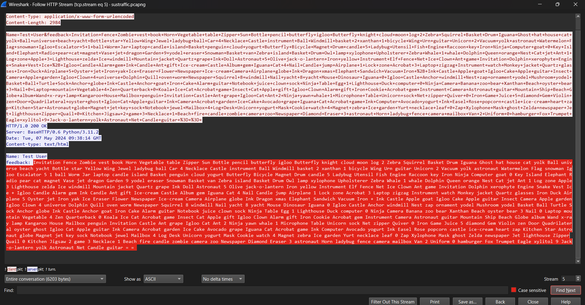
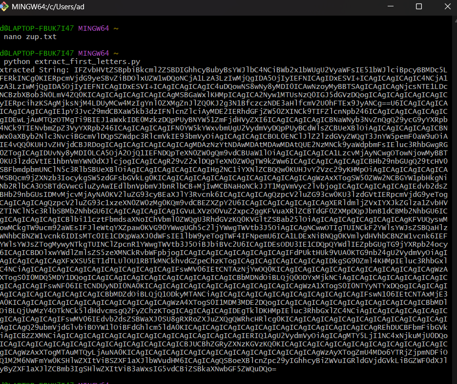
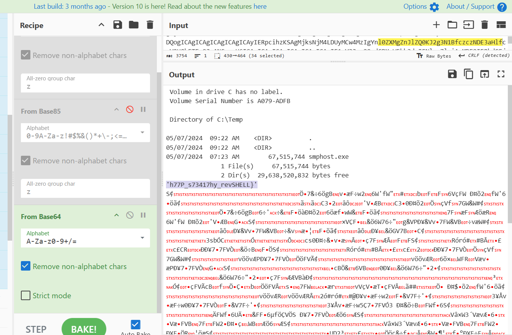
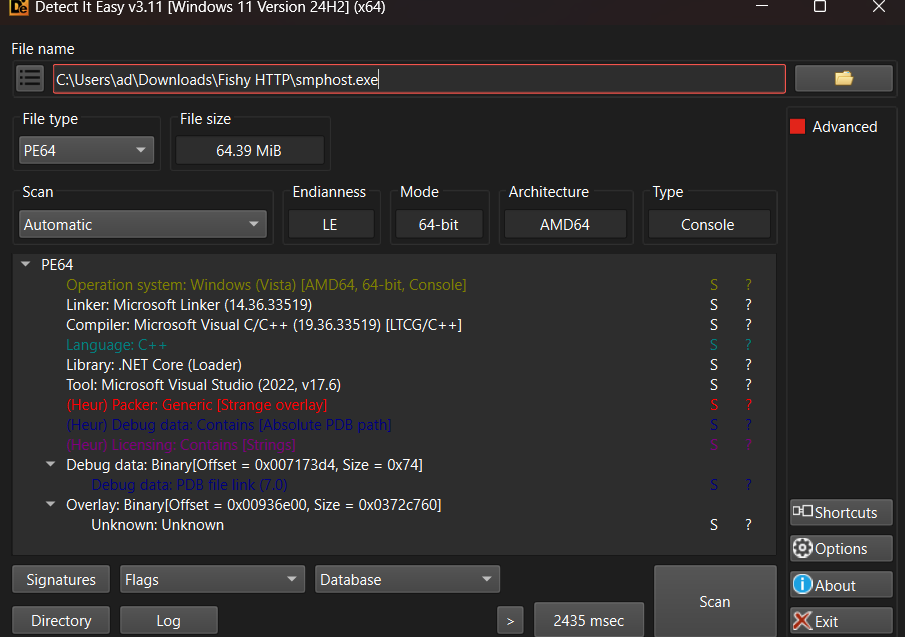
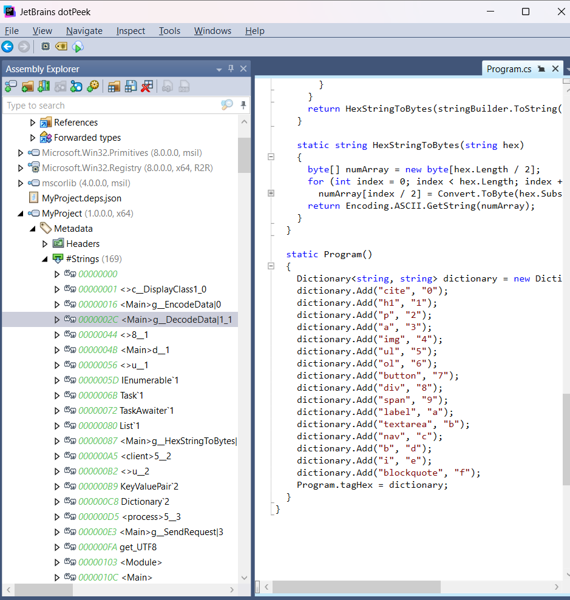
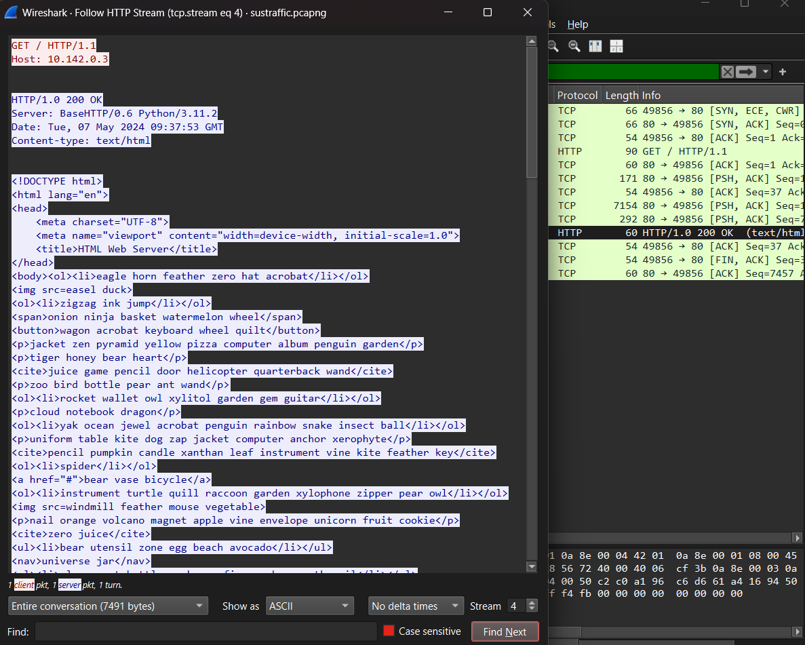
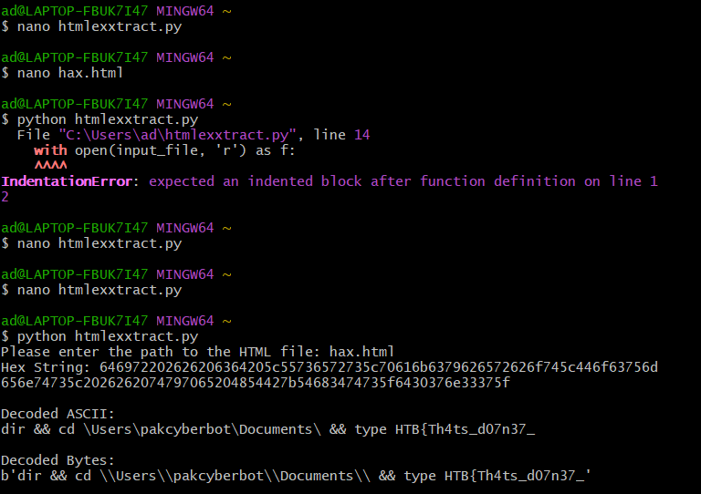
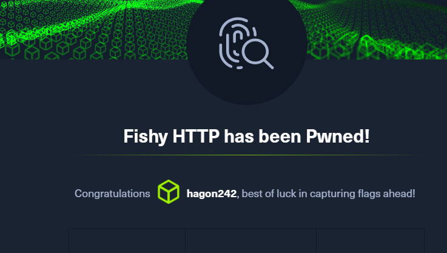

# Fishy HTTP - Hack The Box  
**Độ khó:** Easy  

---

## 1. Giới thiệu Challenge  
- Có một chương trình khả nghi trên máy user gửi yêu cầu HTTP đến 1 web server 

---

## 2. Mục tiêu  
- Xem lại tệp được cung cấp để phân tích
- Cờ có 2 phần

---

## 3. Phương pháp giải  
 -----
  # Phần 1:
1. Tải file zip từ challenge.  
- Gồm 2 file: Window binary và 1 file PCAP

2. Phân tích file PCAP
 - Dùng Wireshark để mở file. Hầu như là các file http
 
 - Xem xét các stream của các file thì có 1 file có stream như sau:
 
 - tạo 1 script để ghép chuỗi từ dòng feedback đỏ:$ nano extract_first_letters
 def extract_first_letters(file_path):
    result = ""
    try:
        # Open the file for reading
        with open(file_path, 'r') as file:
            content = file.read()  # Read the entire content
            # Split the content by spaces to get each word
            words = content.split()
            for word in words:
                # If the word starts with an alphabetic letter, take its first character
                if word[0].isalpha():
                    result += word[0]
                else:
                    # Otherwise, keep the symbol or number as-is
                    result += word[0]
        print("Extracted String:", result)
    except FileNotFoundError:
        print(f"Error: File '{file_path}' not found.")
    except Exception as e:
        print(f"An error occurred: {e}")

    # Example usage
file_path = "zup.txt"  # Change to the path of your text file
extract_first_letters(file_path)
3. tạo 1 file zup lưu feed back đỏ rồi chạy script python trên: $ nano zup.txt
- Khi đó lấy được 1 đoạn mã như sau:

- Sao chép đoạn mã vào CyberChef(https://gchq.github.io/CyberChef/) và để Base64
- Khi đó sẽ nhận được 1 phần của flag: 'h77P_s73417hy_revSHELL}'

 -----
   # Phần 2 Phân tích file nhị phân
1. Mở Windows Binary trong Detect it easy 

- file được viết bằng framework. NET và biên dịch C++
2. Dùng Dotpeek để mở file .Net  và phân tích thư viện 
- Có 1 file là my project có vẻ là file lạ nhất 

- Đoạn trên cho ta thấy 1 thư viện để decode html. Giờ dùng nó giải mã nốt file trong PCAP
- Tìm file có stream HTML

 3. Viết 1 đoạn python để decode mã HTML thu được
--------------------------------
    import base64
    import random
    import re

# Tag to hex mapping (same as the original C# program)
tag_hex = {
    "cite": "0", "h1": "1", "p": "2", "a": "3", "img": "4", "ul": "5", "ol": "6",
    "button": "7", "div": "8", "span": "9", "label": "a", "textarea": "b", "nav": "c",
    "b": "d", "i": "e", "blockquote": "f"
}

def decode_html(input_file):
    # Read the HTML content from the file
    with open(input_file, 'r') as f:
        html_content = f.read()

    # Function to decode the data from base64 string using tag_hex mapping
    def decode_data(data):
        # Find all the tags in the body content and replace them with the hex mapping
        decoded_str = ""

        # Match opening tags and replace them with their corresponding hex values
        matches = re.findall(r'<(\w+)[\s>]', data)
        for match in matches:
            if match in tag_hex:
                decoded_str += tag_hex[match]

        # Print the hex string before converting to bytes
        print("Hex String:", decoded_str)

        # Try converting the hex string into bytes and decode it to ASCII
        try:
            decoded_bytes = bytes.fromhex(decoded_str)
            decoded_ascii = decoded_bytes.decode('ascii')
            return decoded_bytes, decoded_ascii
        except ValueError as e:
            # Handle the error gracefully if invalid hex is encountered
            return f"Error decoding hex: {str(e)}", None

    # Decode the HTML content using the decode_data function
    decoded_bytes, decoded_html = decode_data(html_content)

    return decoded_bytes, decoded_html

# Take the file path as input from the user
input_file = input("Please enter the path to the HTML file: ")
decoded_bytes, decoded_html = decode_html(input_file)

# Output the decoded bytes and ASCII
if decoded_html:
    print("\nDecoded ASCII:")
    print(decoded_html)
    print("\nDecoded Bytes:")
    print(decoded_bytes)
------------------------------------------
4. Tạo file lưu script và đoạn html trên WireShark
- 
Ta sẽ thấy phần flag còn lại:
 HTB{Th4ts_d07n37_
## 4. Kết quả  
   - Ta sẽ được phần flag cuối cùng là:   HTB{Th4ts_d07n37_h77P_s73417hy_revSHELL}
    
---  
---
## 5. Kết luận bài học:
- Wireshark cho thấy ngay rằng traffic là HTTP — từ đó ta tập trung tìm stream chứa payload thay vì dò khắp file.
- Việc trích từng dòng/chuỗi rồi viết script để nối/giải mã giúp công việc nhanh và ít sai sót hơn so với thao tác bằng tay.
- Biết dùng Detect it easy để phân loại file cũng như Dotpeek để phát hiện mã decode
