#  Obsecure – Hack The Box

**Độ khó:** Easy  
**Thể loại:** Forensics / Network / Web

---

## 1 Giới thiệu Challenge

- Hacker lợi dụng lỗi upload file tùy ý để tải lên một webshell PHP (`support.php`)
- Dịch vụ HTTP đã bị tắt
- Chỉ còn lại log mạng (tcpdump/pcap) trong 2 phút trước thời điểm phát hiện

---

## 2 Mục tiêu

- Phân tích log mạng
- Xác định các lệnh hacker đã thực thi
- Đánh giá mức độ hệ thống bị xâm phạm

---

## 3 Phương pháp giải

- Sau khi tải file ZIP, ta thu được:
  - 1 file PCAP
  - 1 file PHP (webshell)

---

## Phần 1: Phân tích file PHP

### Bước 1: Phân tích logic webshell

- Sao chép file PHP và chạy thử tại:
  `https://www.onlinegdb.com/online_php_interpreter`

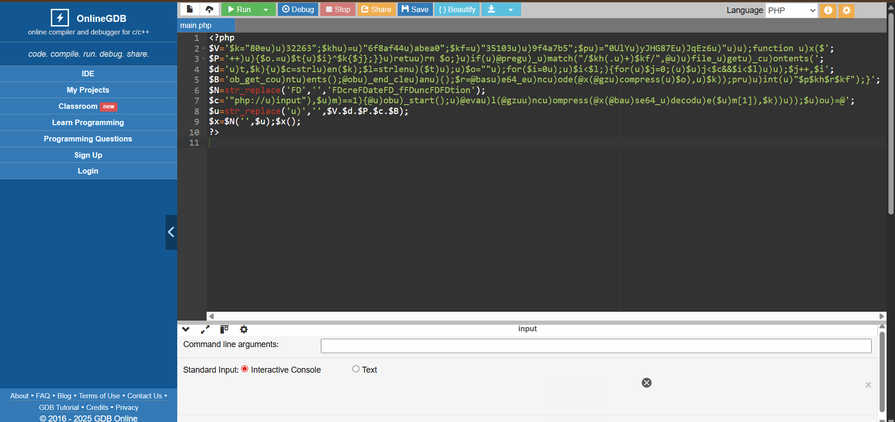

- Quan sát mã nguồn:
  - Dòng 6: Hàm `N` thay thế `FD` để tạo `create_function`
  - Dòng 9: Tạo hàm `N` với code `$u` và sau đó thực thi hàm này

---

### Bước 2: Phân tích các hàm quan trọng

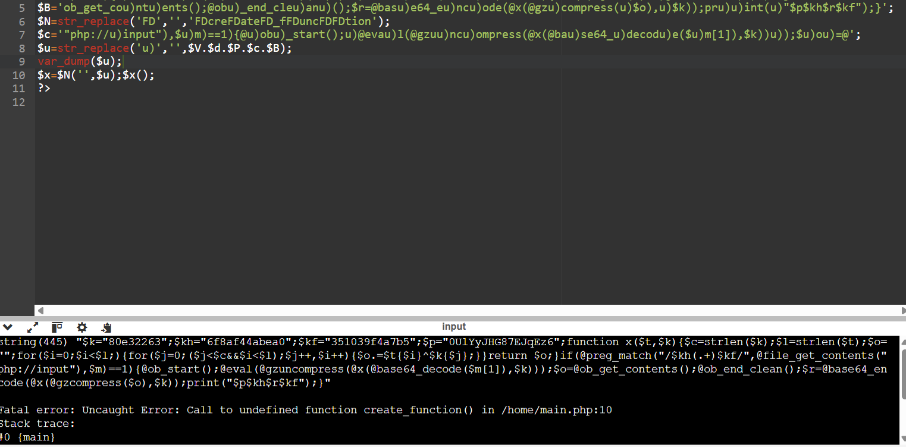

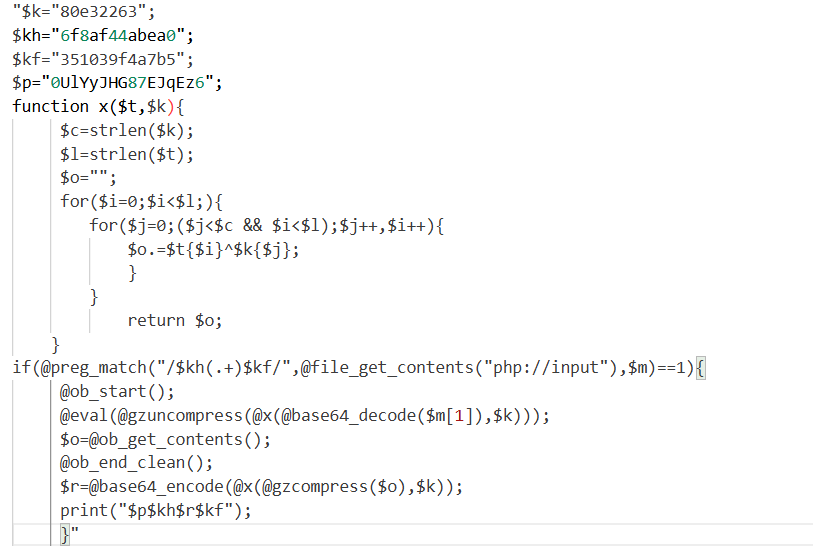

#### 1. Khởi tạo khóa và hàm mã hóa

- Các biến `$k`, `$kh`, `$kf`, `$p`:
  - Là các chuỗi khóa (key) và chuỗi định danh
- Hàm `x($t, $k)`:
  - Thực hiện **Repeating-key XOR**
  - Có tính đối xứng → dùng cho cả mã hóa và giải mã

#### 2. Xử lý dữ liệu đến

- Đọc toàn bộ dữ liệu POST bằng:

```php
@file_get_contents("php://input")
```

- Sử dụng `preg_match` để tìm dữ liệu nằm giữa `$kh` và `$kf`
- Nếu tìm thấy:
  - Giải mã theo chuỗi:
    - Base64
    - XOR với key `$k`
- Thu thập output bằng output buffer

#### 3. Gửi dữ liệu phản hồi

- Mã hóa ngược lại:
  - Gzip
- In dữ liệu phản hồi đã mã hóa

-> Kết luận:  
**Cần tìm dữ liệu đầu vào của `php://input` trong file PCAP**

---

##  Phần 2: Phân tích file PCAP

### Bước 1: Theo dõi HTTP stream

- Mở PCAP bằng Wireshark
- Sử dụng **Follow HTTP Stream**

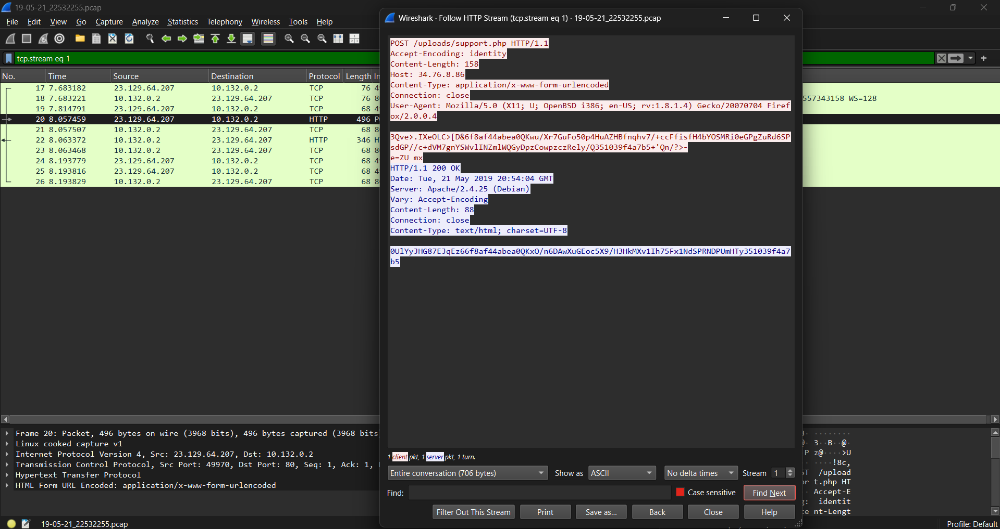

- Thu được dữ liệu:

```text
Input:
6f8af44abea0QKwu/Xr7GuFo50p4HuAZHBfnqhv7/+ccFfisfH4bYOSMRi0eGPgZuRd6SPsdGP//c+dVM7gnYSWvlINZmlWQGyDpzCowpzczRely/Q351039f4a7b5

Output:
0UlYyJHG87EJqEz66f8af44abea0QKxO/n6DAwXuGEoc5X9/H3HkMXv1Ih75Fx1NdSPRNDPUmHTy351039f4a7b5
```

---

### Bước 2: Thử đưa input vào PHP

- Thay dữ liệu input vào `php://input`

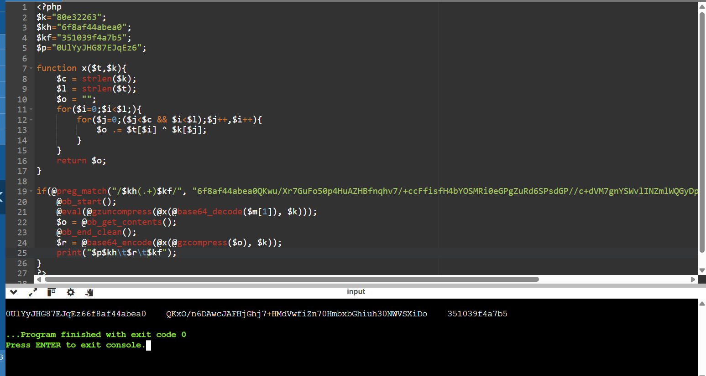

-> Output không khớp → cần **giải mã ngược bằng XOR**

---

### Bước 3: Giải mã XOR

- Tiến hành XOR ngược lại theo logic hàm `x()`

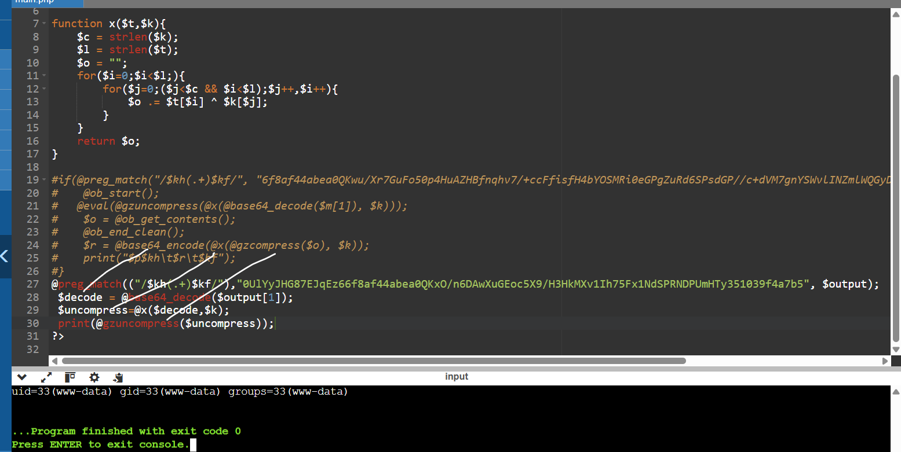

---

### Bước 4: Phân tích các stream đã decode

- Stream 1:
  - Thu được `uid` và `id`

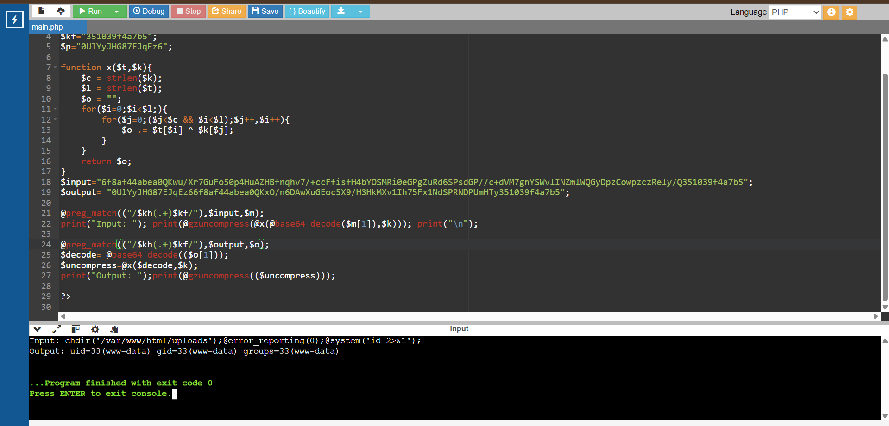

- Stream 23:

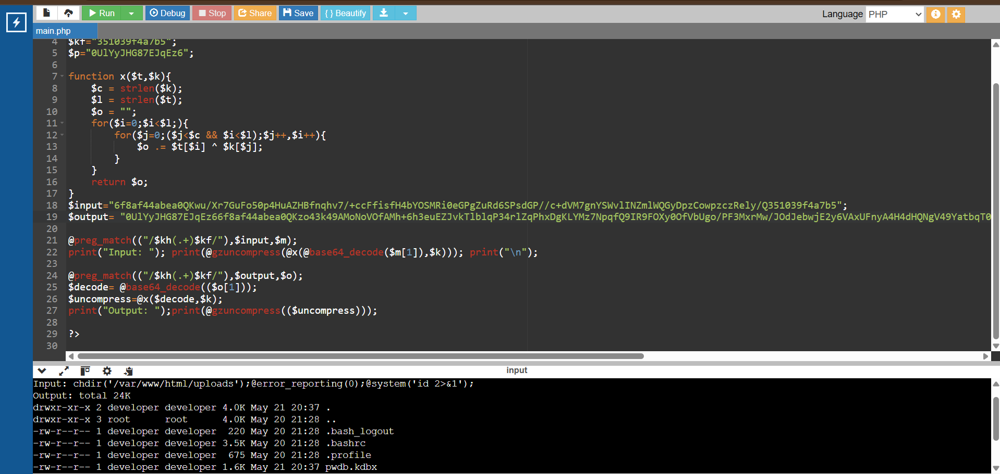

- Stream 24:

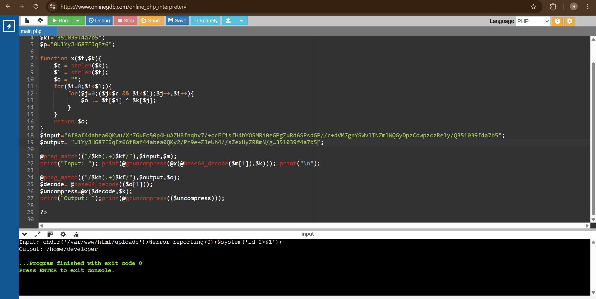

- Stream 25:


-> Timeline tấn công:

```text
- Lấy uid, id
- Thực thi ls -lah /home
- Di chuyển tới /home/developer
- Dump file pwdb.kdbx
```

---

### Bước 5: Trích xuất file KeePass

- Lưu dữ liệu dump thành file `pwdb.kdbx`

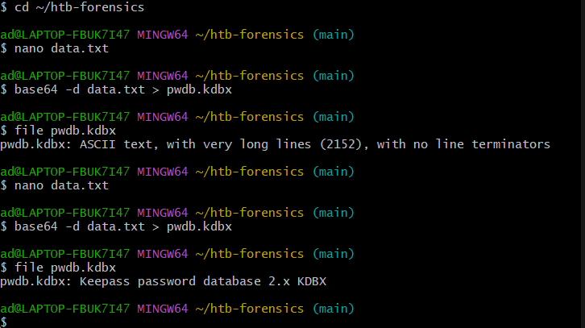

---

### Bước 6: Crack mật khẩu KeePass

- Chuyển file sang hash bằng `keepass2john`

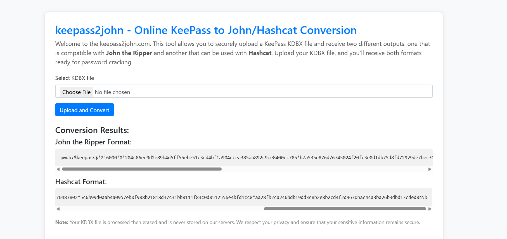

- Dùng `hashcat` để crack password

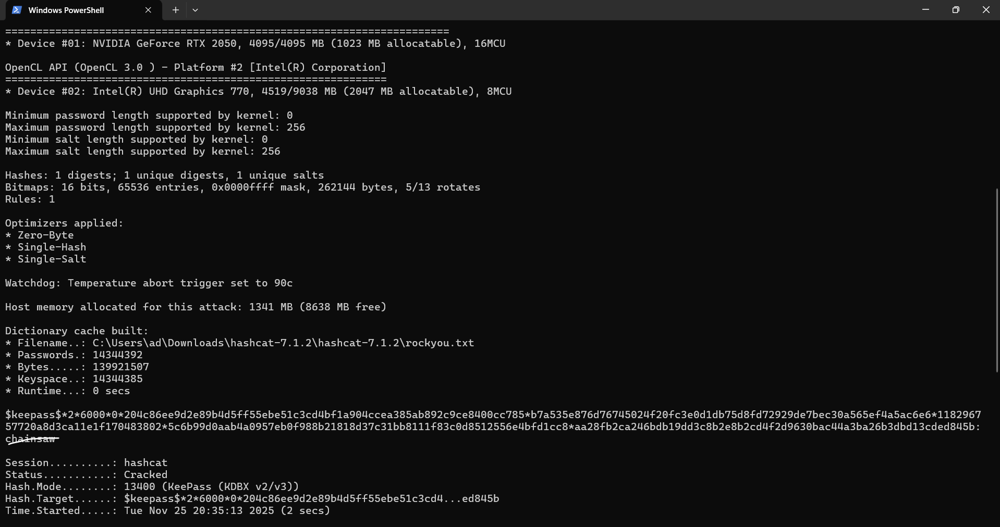

- Mở file KeePass và lấy flag

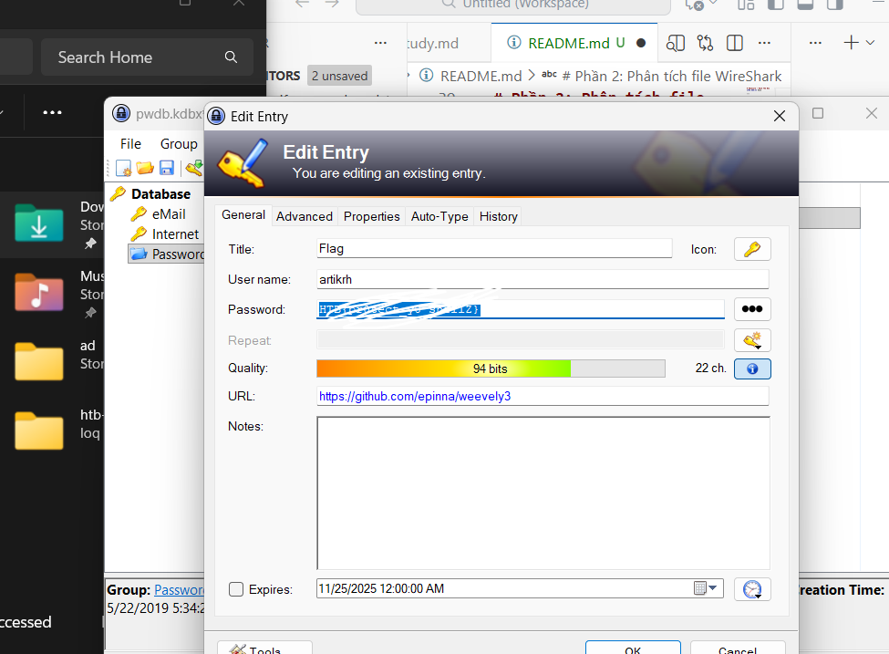

---

## 4 Flag

```text
HTB{pr0tect_y0_shellZ}
```

---

## 5 Kết luận & Bài học rút ra

- Challenge mô phỏng hoàn chỉnh quá trình phân tích **webshell/backdoor**
- Thể hiện kỹ thuật:
  - Repeating-key XOR
  - Base64 + Gzip
  - Phân tích PCAP để tái dựng hành vi attacker
- Rèn luyện kỹ năng:
  - Phân tích mã PHP độc hại
  - Giải mã dữ liệu từ network traffic
  - Tái tạo timeline tấn công từ log mạng
