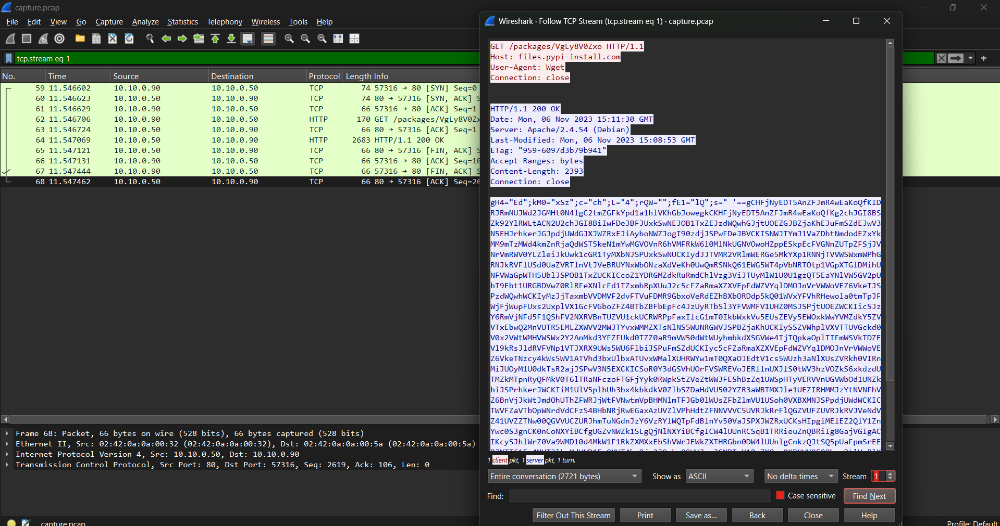
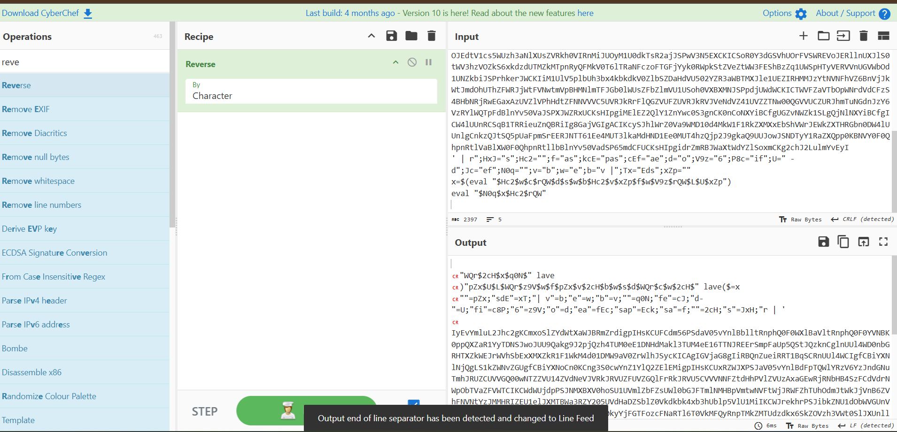
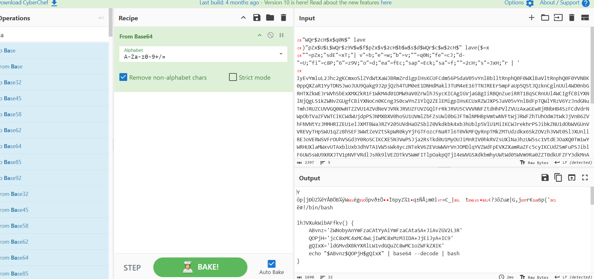
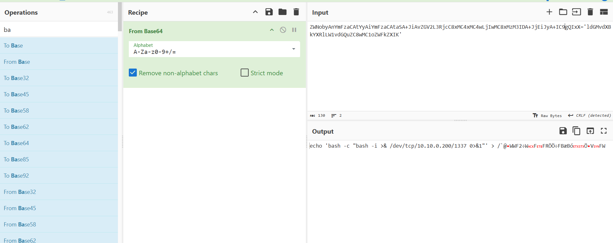
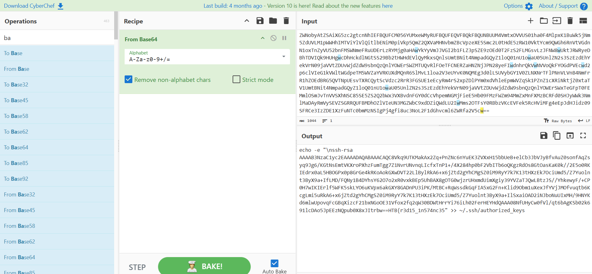
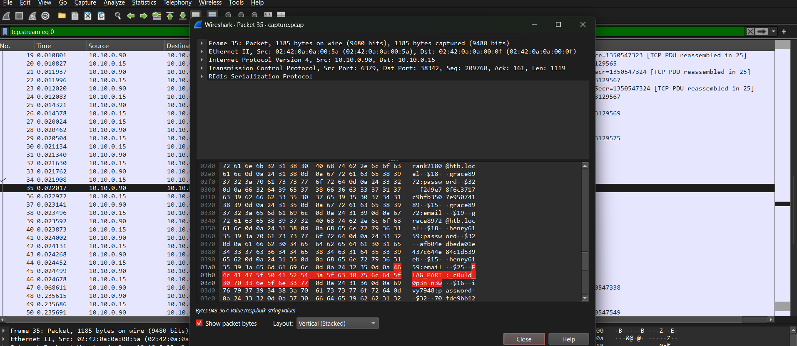
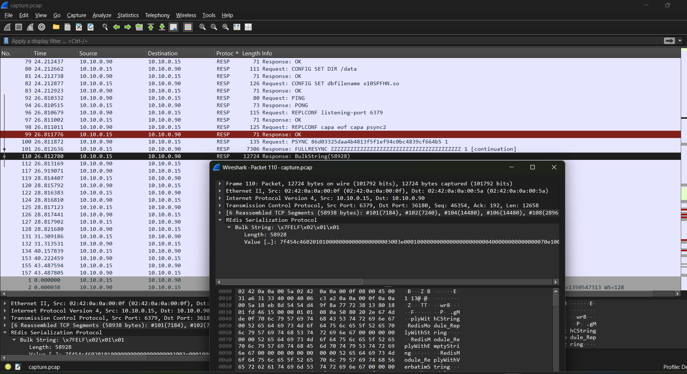
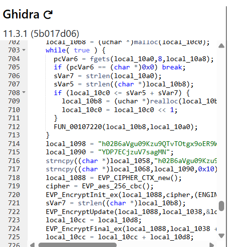
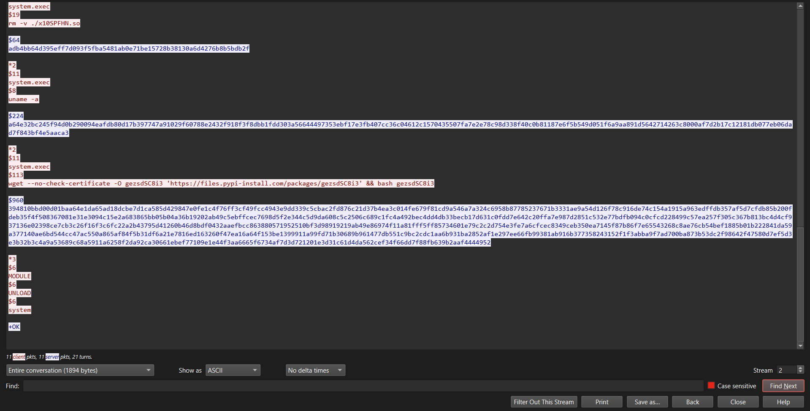
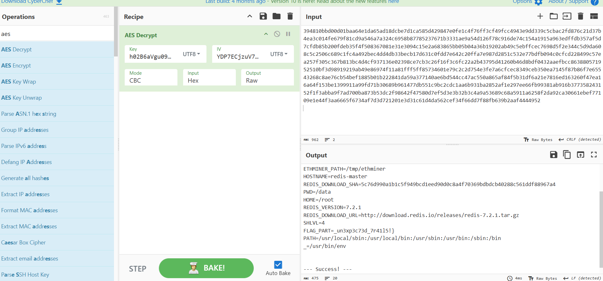

# RedTrails – Hack The Box

**Độ khó:** Easy  
**Thể loại:** Forensics / Network Analysis / Redis / Malware

---

## 1 Giới thiệu Challenge

- Đội SOC phát hiện hoạt động bất thường trên một **Redis instance**
- Redis đã được cấu hình mật khẩu nhưng attacker vẫn truy cập được
- Điều này cho thấy kẻ tấn công đã lợi dụng kỹ thuật hoặc lỗ hổng để truy cập trái phép

---

## 2 Mục tiêu

- Tìm hiểu cách attacker truy cập Redis
- Phân tích các dấu vết và hành vi bất thường
- Thu thập **đủ 3 phần flag**

---

## 3 Phương pháp giải

### Bước 1: Phân tích file capture

- Ở **stream 1** phát hiện đoạn mã chứa chuỗi **Base64**



- Nhận thấy:
  - Chuỗi bị chia nhỏ
  - Cuối payload có `eval`
- Cần **reverse chuỗi** trước khi decode

 



- Copy mã vào file reverse để xử lý
- Phân tích hai hàm ghép ký tự
- Sau khi ghép và decode Base64, thu được:

 



- Nhận được **phần 1 của flag**:

```text
HTB{r3d15_1n574nc35
```

---

### Bước 2: Tìm flag trong RESP packet

- Tiếp tục phân tích các packet Redis (RESP protocol)
- Tìm thấy phần flag trong **packet 35**



- **FLAG PART 2:**

```text
_c0uld_0p3n_n3w
```

---

### Bước 3: Phân tích file binary bất thường

- Trong quá trình tìm packet, phát hiện file có:
  - Kích thước bất thường
  - Header `7f 45 4c 46` → **ELF binary**



- Import binary vào **Ghidra** để reverse



- Phát hiện:
  - Key: `h02B6aVgu09Kzu9QTvTOtgx9oER9WIoz`
  - IV: `YDP7ECjzuV7sagMN`

- Cần tìm đoạn code decrypt tương ứng



- Nhận thấy biến `x10SHp` chứa dữ liệu mã hóa
- Thử decode bằng **CyberChef**



- Thu được **phần flag cuối cùng**:

```text
_un3xp3c73d_7r41l5!}
```

---

## 4 Flag hoàn chỉnh

```text
HTB{r3d15_1n574nc35_c0uld_0p3n_n3w_un3xp3c73d_7r41l5!}
```

---

## 5 Kết luận & Bài học rút ra

- Cuộc tấn công khai thác Redis trái phép để thực thi mã độc theo **hai giai đoạn**:

### Giai đoạn 1
- Thực thi payload che giấu
- Dùng `eval` + Base64 để tải binary độc hại

### Giai đoạn 2
- Binary ELF được giải mã bằng:
  - Key / IV hard-code trong hàm `DoCommand`
- Payload thực tế cài đặt **ethminer**

### Kết luận thực tế
- Đây là một cuộc tấn công **Cryptojacking**
- Nhấn mạnh:
  - Cần giới hạn truy cập Redis
  - Không expose Redis ra Internet
  - Disable các lệnh nguy hiểm (`CONFIG`, `EVAL`, `MODULE LOAD`)
