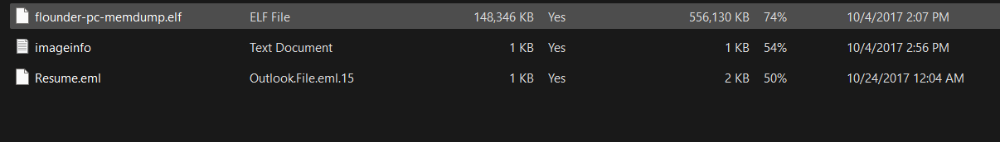
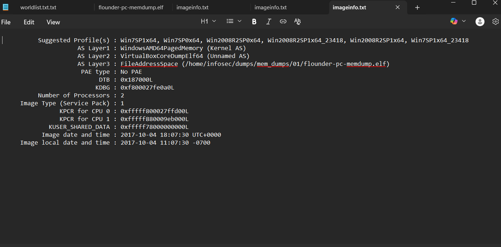
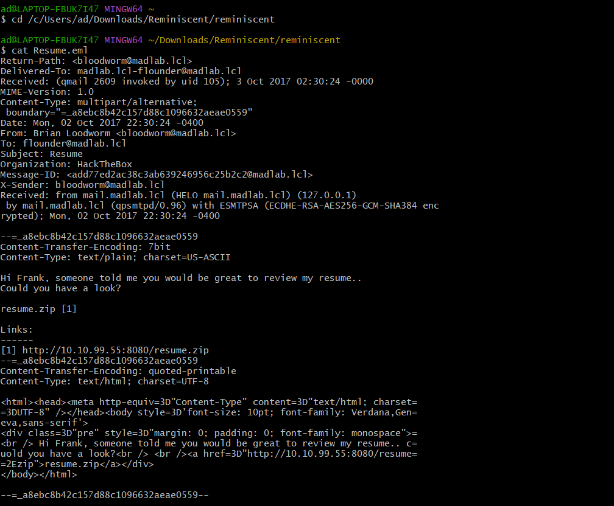
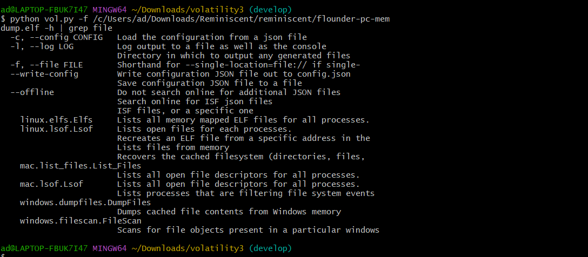
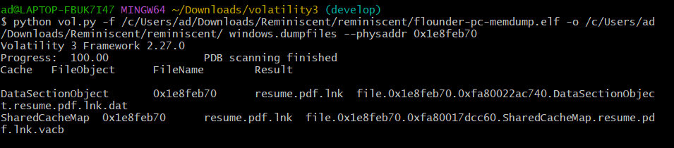
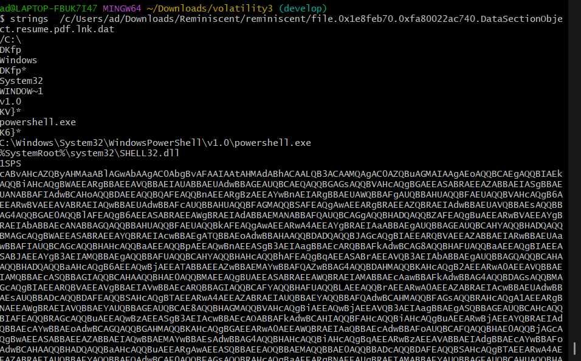
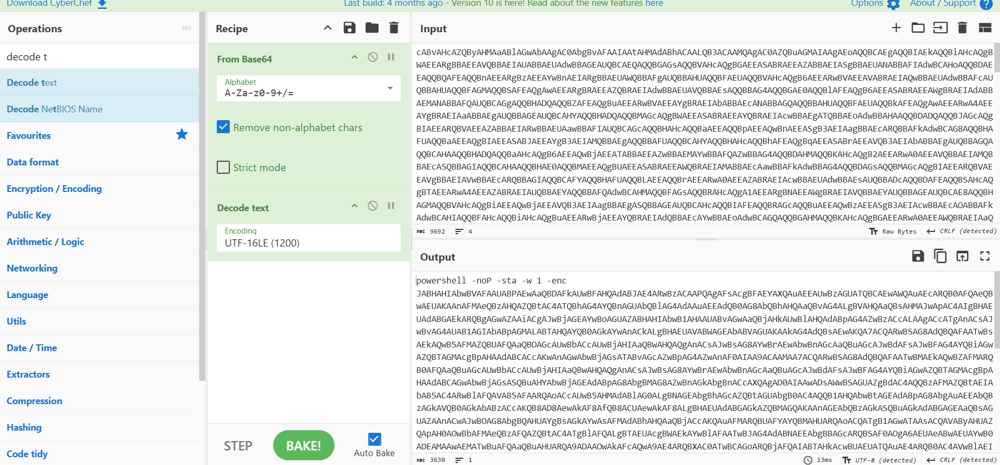
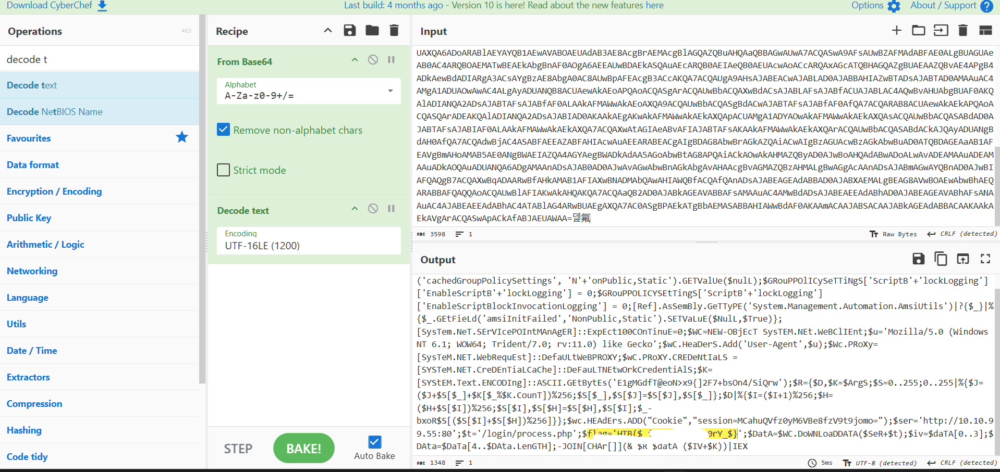

# Reminiscent – Hack The Box

**Độ khó:** Easy  
**Thể loại:** Forensics 

---

## 1 Giới thiệu Challenge

- Một máy tính ảo (VM) của nhân viên tuyển dụng đã bị nhiễm mã độc
- Nguồn lây nhiễm có khả năng đến từ một email lừa đảo (phishing)
- Email được ngụy trang thành một hồ sơ xin việc (resume)

---

## 2 Mục tiêu

- Điều tra nguồn gốc và hành vi của mã độc
- Trích xuất flag từ các artifact thu thập được

---

## 3 Phương pháp giải

- Sau khi tải file challenge, ta thu được **3 file**:



### 🔹 Các file bao gồm

- **flounder-pc-memdump.elf**  
  - Bản dump toàn bộ RAM của máy ảo `flounder-pc` tại thời điểm ghi nhận
  - Định dạng ELF thường dùng trên Linux nhưng cũng được Volatility sử dụng để lưu memory dump

- **imageinfo.txt**  
  - File output từ Volatility Framework
  - Chứa thông tin profile và gợi ý plugin phù hợp



- **Resume.eml**  
  - File email hoàn chỉnh ở định dạng EML
  - Chứa nội dung phishing email mà nạn nhân nhận được

---

## Bước 1: Phân tích file Resume.eml

- Mở file `Resume.eml` để xem nội dung email



- Email dụ người dùng tải file từ link:

```text
http://10.10.99.55:8080/resume.zip
```

-> Cần tìm và phân tích artifact liên quan đến `resume.zip`

---

## Bước 2: Phân tích memory dump

### Liệt kê plugin Volatility

- Sử dụng **Volatility 3** để liệt kê các plugin khả dụng



---

### Tìm file trong bộ nhớ

- Dùng plugin `windows.filescan.Filescan` để tìm các file liên quan:


- Phát hiện artifact còn sót lại:

```text
resume.pdf.lnk
```

---

### Dump file từ memory

- Dùng plugin `windows.dumpfiles.DumpFiles` để trích xuất file:



---

### Phân tích nội dung file dump

- Sử dụng `strings` để tìm keyword đáng ngờ:



- Phát hiện một chuỗi **Base64 encoded**

---

## Bước 3: Giải mã chuỗi ẩn

### Decode bằng CyberChef

- Dán chuỗi Base64 vào **CyberChef**
- Decode bằng:
  - Base64
  - UTF-16LE



---

### Decode bằng PowerShell

- Tiếp tục giải mã đoạn script PowerShell thu được



-> Thu được **flag**

---


## 4 Kết luận & Bài học rút ra

- Phân tích bộ nhớ (memory forensics) rất quan trọng khi mã độc:
  - Không ghi xuống ổ đĩa (fileless malware)
  - Đã bị xóa khỏi filesystem
- Volatility cho phép khôi phục artifact từ RAM
- Kết hợp:
  - Phân tích email
  - Memory dump
  - Decode nhiều lớp (Base64, UTF-16LE, PowerShell)
- Giúp tái dựng toàn bộ chuỗi tấn công của kẻ tấn công
