#  TrueSecret – Hack The Box

**Độ khó:** Easy  
**Thể loại:** Forensics

---

## 1 Giới thiệu Challenge

- Bối cảnh: Lực lượng chức năng bắt giữ thủ lĩnh một nhóm APT
- Thu được bản chụp bộ nhớ (memory dump) từ máy tính đang chạy của hắn
- Nhóm APT sử dụng một **máy chủ Command & Control (C2) tùy chỉnh**

---

## 2 Mục tiêu

- Phân tích memory dump
- Trích xuất hoặc tái tạo:
  - Mã nguồn C2
  - Cấu hình
  - Giao thức giao tiếp của máy chủ C2

---

## 3 Phương pháp giải

### Bước 1: Phân tích file ZIP và memory dump

- Giải nén file được cấp, thu được:

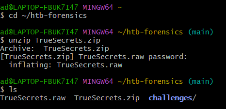

- File `TrueSecrets.raw` được nhận diện là **file data**
- Sử dụng **Volatility 2** để phân tích


---

### Bước 2: Xác định profile hệ điều hành

- Thử profile:

```text
Win7SP1x86_23418
```

- Liệt kê các process đang chạy:

```bash
vol -f TrueSecrets.raw --profile=Win7SP1x86_23418 pslist
```

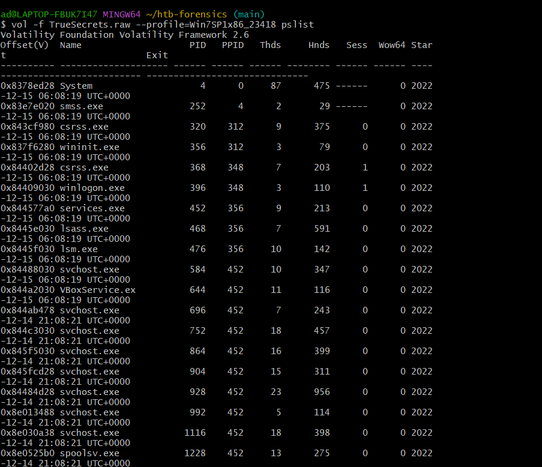

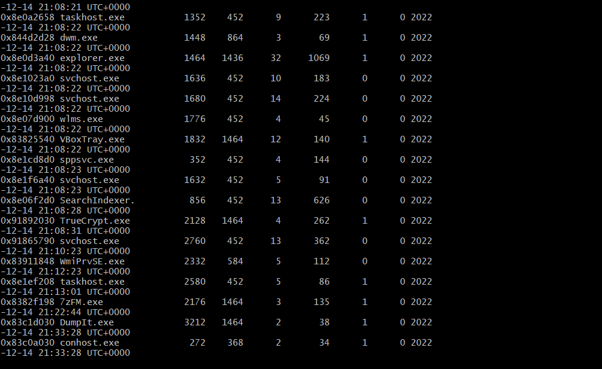

- Các process đáng chú ý:
  - `TrueCrypt.exe`
  - `DumpIt.exe` (tool dump RAM)
  - `7zFM.exe` (nén/giải nén)
  - `WiMPrvSE.exe` (process thường bị giả mạo)

---

### Bước 3: Phân tích command line

- Kiểm tra tham số dòng lệnh của các process:

```bash
vol -f TrueSecrets.raw --profile=Win7SP1x86_23418 cmdline
```

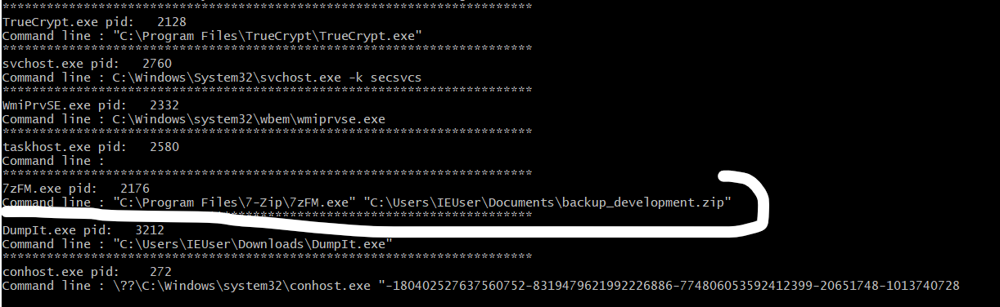

- Phát hiện `7zFM.exe` trỏ tới một file ZIP backup

---

### Bước 4: Trích xuất file ZIP từ RAM

- Dump file ZIP từ memory

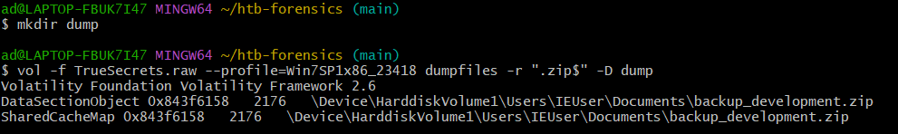

- Sau khi trích xuất thu được:
  - 2 file dạng `.dat` và `.vacb`

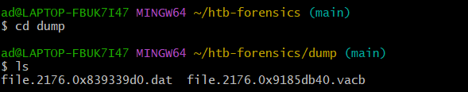

- Giải nén tiếp thu được file có đuôi:

```text
.tc
```

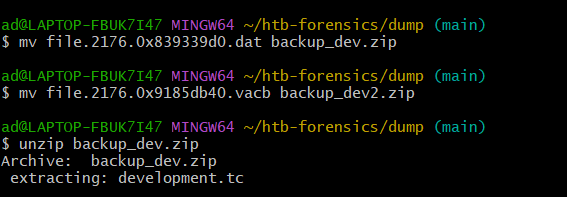

---

### Bước 5: Bẻ khóa file TrueCrypt

- Sử dụng plugin Volatility:

```bash
vol -f TrueSecrets.raw --profile=Win7SP1x86_23418 truecryptpassphrase
```

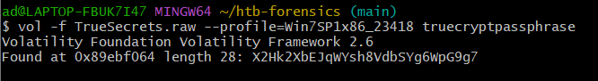

- Mật khẩu thu được:

```text
X2Hk2XbEJqWYsh8VdbSYg6WpG9g7
```

---

### Bước 6: Mount container TrueCrypt

- Dùng **VeraCrypt 1.25** để mount file `.tc`

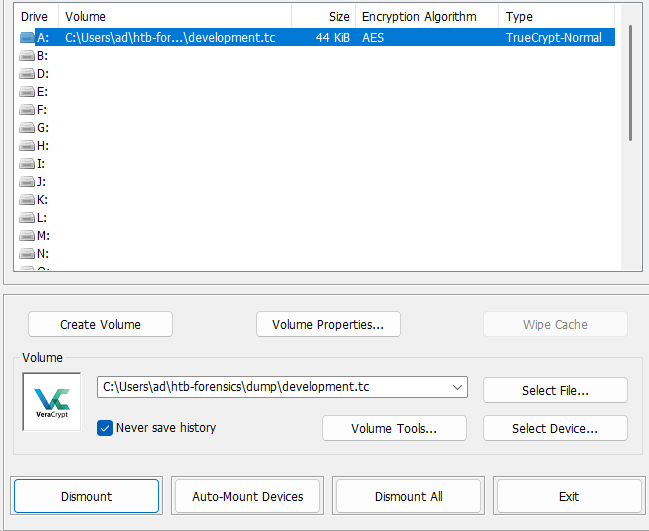

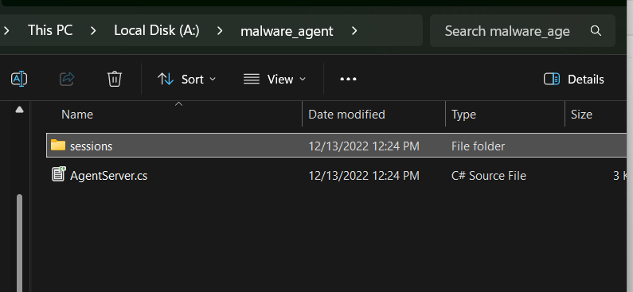

- Truy cập thư mục **agent server**
- Phát hiện đoạn code mã hóa bất thường


---

### Bước 7: Phân tích mã hóa C2

- Đoạn code sử dụng:
  - Thuật toán **DES**
  - Key và IV **cố định**
- Plaintext → Encrypt → Ciphertext dạng **Base64**

---

### Bước 8: Viết script giải mã

- Viết script decrypt để giải mã file session còn lại

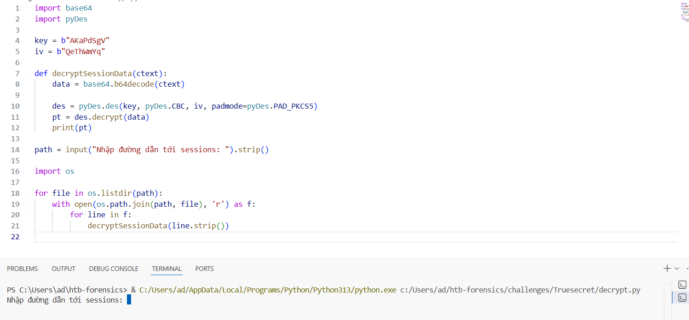

- Chạy script và thu được dữ liệu giải mã

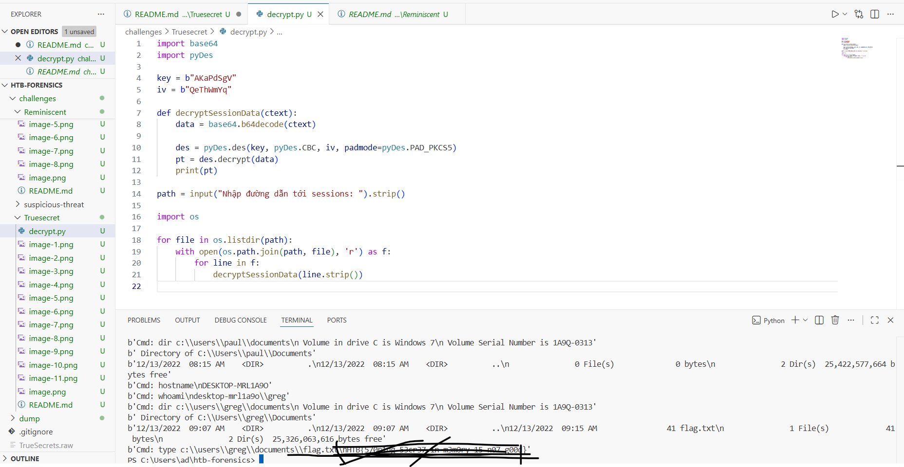

---


## 4 Kết luận & Bài học rút ra

- Nhóm APT sử dụng **hai lớp che giấu**:
  - Mã hóa volume bằng TrueCrypt
  - C2 tùy chỉnh với mã hóa DES cố định
- Sai lầm nghiêm trọng:
  - Không xóa sạch dữ liệu nhạy cảm khỏi RAM
- Volatility đã:
  - Trích xuất thành công mật khẩu TrueCrypt từ bộ nhớ
  - Cho phép truy cập mã nguồn C2
  - Tái tạo và đảo ngược thuật toán mã hóa DES
- Bài học:
  - **Memory forensics** là chìa khóa để phá vỡ các lớp mã hóa tĩnh
  - Thu thập RAM sớm có thể tiết lộ key, passphrase và protocol C2 bị bỏ sót
