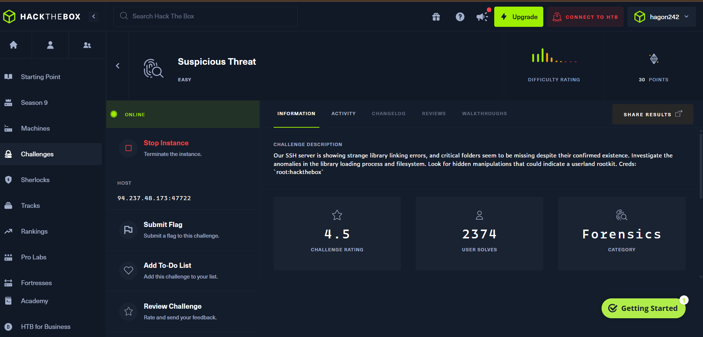

#Suspicious Threat - Hack The Box
**Độ khó:** Easy

----

##1. Giới thiệu Challenge
SSH server có lỗi liên kết thư viện bất thường. Nhiệm vụ: tìm rootkit userland.
##2. Mục tiêu
Tìm flag bằng cách điều tra filesystem và library manipulation

##3. Phương pháp giải
Bước 1:  Khởi tạo instance bằng 'Start Instance'

- SSH vào ip được cấp:
$ ssh root@94.237.48.173 -p 47722
- Sau đó đăng nhập password: hackthebox
Bước 2: Khám phá thư viện
 Theo đề bài có lỗi ở thư viện động nên ta sẽ check danh sách:   $ ldd /bin/ls. Khi đó hiện ra
   
=> file libc.hook.so.6 khả nghi
- Tiếp tục di chuyển libc.hook.so.6 về thư mục hiện tại và truy cập vào nó bằng câu lệnh
$ mv /lib/x86_64-linux-gnu/libc.hook.so.6 ./
$ ls -ahl

Bước 3: tìm flag
 Liệt kê các chi tiết trong thư mục sau đó thử các mục khả nghi thì phát hiện ra thư mục pr3l04d_ chứa flag:

bằng các câu lệnh:
$ ls -ahl /var/
$ ls -ahl /var/pr3l04d_
$ cat /var/pr3l04d_/flag.txt

-Submit flat và hoàn thành:
HTB{Us3rL4nd_R00tK1t_R3m0v3dd!}
Bước 4: Dọn dẹp
Sau khi thu được "flag", tiến hành dọn dẹp hệ thống:
+Sao lưu thư mục độc hại:
    tar -czvf /root/pr3l04d_backup.tar.gz /var/pr3l04d_
+Xóa thư mục:
     rm -rf /var/pr3l04d_
+Tái tạo bộ nhớ đệm liên kết thư viện (linker cache) để hoàn tất việc loại bỏ:
    ldconfig

##4. Kết luận
- Rootkit lợi dụng biến môi trường LD_PRELOAD để hook các hàm như readdir và fopen, từ đó che giấu tệp và thư mục.
-Lệnh ldd có thể được sử dụng để kiểm tra các thư viện được liên kết với các lệnh cơ bản.
