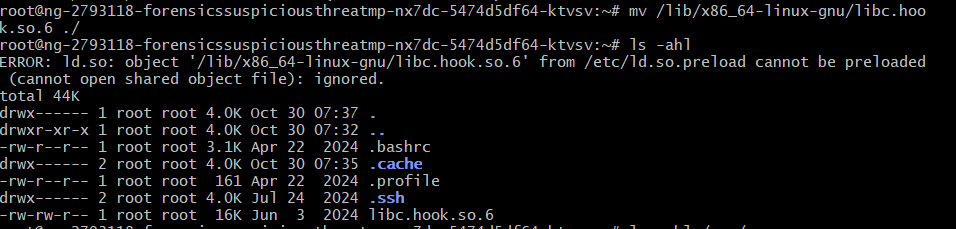

#  Suspicious Threat – Hack The Box

**Độ khó:** Easy  
**Thể loại:** Forensics / Linux

---

## 1 Giới thiệu Challenge

- SSH server có lỗi liên kết thư viện bất thường
- Nhiệm vụ: phát hiện và điều tra **userland rootkit**

---

## 2 Mục tiêu

- Tìm flag bằng cách điều tra filesystem
- Phân tích hiện tượng **library manipulation**

---

## 3 Phương pháp giải

### Bước 1: Khởi tạo instance và SSH

- Khởi tạo máy bằng nút **Start Instance**


- SSH vào IP được cấp:

```bash
ssh root@94.237.48.173 -p 47722
```

- Đăng nhập với mật khẩu:

```text
hackthebox
```

---

### Bước 2: Khám phá thư viện động

Theo mô tả đề bài, hệ thống có lỗi liên quan tới **dynamic library**, vì vậy kiểm tra các thư viện liên kết của lệnh cơ bản:

```bash
ldd /bin/ls
```


- Phát hiện thư viện khả nghi:

```text
libc.hook.so.6
```

-> Đây là dấu hiệu của **LD_PRELOAD hook**

---

### Bước 3: Phân tích thư viện khả nghi

Di chuyển thư viện đáng ngờ về thư mục hiện tại để kiểm tra:

```bash
mv /lib/x86_64-linux-gnu/libc.hook.so.6 ./
ls -ahl
```



---

### Bước 4: Tìm flag trong filesystem

Liệt kê các thư mục khả nghi trong `/var`:

```bash
ls -ahl /var/
```

 


- Phát hiện thư mục bất thường:

```text
pr3l04d_
```

Tiếp tục kiểm tra:

```bash
ls -ahl /var/pr3l04d_
cat /var/pr3l04d_/flag.txt
```

---

###  Flag

```text
HTB{Us3rL4nd_R00tK1t_R3m0v3dd!}
```

---

### Bước 5: Dọn dẹp hệ thống

Sau khi thu được flag, tiến hành loại bỏ rootkit:

- Sao lưu thư mục độc hại:

```bash
tar -czvf /root/pr3l04d_backup.tar.gz /var/pr3l04d_
```

- Xóa thư mục:

```bash
rm -rf /var/pr3l04d_
```

- Tái tạo linker cache để hoàn tất việc loại bỏ:

```bash
ldconfig
```

---

## 4 Kết luận & Bài học rút ra

- Rootkit userland có thể lợi dụng biến môi trường **LD_PRELOAD** để hook các hàm như `readdir`, `fopen`, từ đó che giấu file và thư mục
- Lệnh `ldd` rất hữu ích để kiểm tra các thư viện được liên kết với các binary hệ thống
- Challenge giúp hiểu rõ cách phát hiện và xử lý **userland rootkit** trong môi trường Linux
